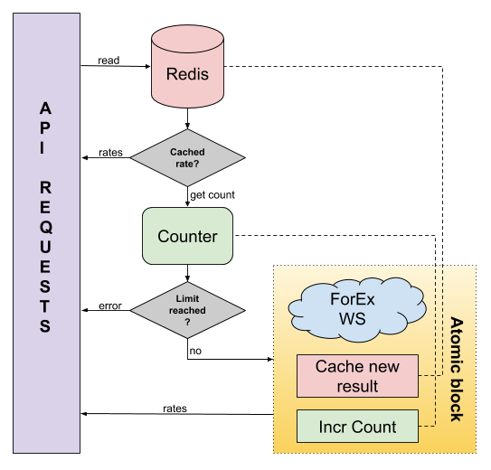

Having introduced Haskell at my last job I wanted to put into practice all the stuff I learned: take the good, leave the bad. So I started working on an [exchange rates API](https://github.com/gvolpe/exchange-rates) using a few libraries I haven't used before, exclusively for fun and learning purposes.

In this blog post I'll try to share what I have identified as good practice so far and what are my personal
recommendations when writing a Haskell application.

> Note: if you write Scala, many of the tips will also be useful for you.

### Configuration

I tried a couple of libraries where you must write your configuration file using either `yaml`, `hocon` or `json` but I wasn't satisfied until I've been recommended to use [dhall-lang](https://dhall-lang.org/). It's a configuration language guaranteed to terminate that has also Haskell bindings, [nicely packaged](https://hackage.haskell.org/package/dhall) for easy use. It looks as follows:


let Env = < Test : {} | Prod : {} >

let makeConfig = λ(env : Env) ->
  { forex = makeForexConfig env
  , redis = makeRedisConfig env
  }

in makeConfig ( Env.Test {=} )


Yes, it's a language so one can define functions! Neat huh?

### Production-ready effect: RIO

Ever since I read Michael Snoyman's articles [The ReaderT design pattern](https://www.fpcomplete.com/blog/2017/06/readert-design-pattern) and [The RIO Monad](https://www.fpcomplete.com/blog/2017/07/the-rio-monad) I've been convinced that this
is the nicest and easiest approach to write applications.

Two years later after these articles have been published the package has evolved into what they call [RIO: A standard
library for Haskell](https://hackage.haskell.org/package/rio).

It doesn't only package `RIO`, its monadic effect, but also its own prelude. And in addition, it re-exports a bunch of other goodies such as error handling and lenses functions.

So right now this is my effect system of choice and it's the one you'll see in the examples below.

> It's worth mentioning other (higher-order) effects like [fused-effects](https://github.com/fused-effects/fused-effects) and [polysemy](https://github.com/polysemy-research/polysemy), and also [capability](https://github.com/tweag/capability). I think we should all keep an eye on them as they look promising and propose a different take on effects.

### Polymorphic record of functions

This is by far the best way I know of defining polymorphic interfaces.


data Cache m = Cache
  { cacheNewResult :: Expiration -> Currency -> Currency -> Exchange -> m ()
  , cachedExchange :: Currency -> Currency -> m (Maybe Exchange)
  }



data Counter m = Counter
  { incrCount :: m ()
  , getCount :: m Int
  , resetCount :: m ()
  }


The advantage is that we can create different interpreters using different effect types. For example, the main implementation of `Cache m` uses `Redis` whereas the test one uses an in-memory map stored in an `IORef`.

##### Why not typeclasses?

Typeclasses are probably what come first when we think about polymorphic interfaces. However, they need laws / properties that define whether an instance is a valid one or not. Secondly, we can only define a single instance for a specific type. This is called coherence. If we can do that, great! If we fail then we would be better off using a record of functions instead.

To further defend this argument I should, perhaps, write another blog post only on this topic showing examples and expanding on the idea.

### Smart constructors

In order to create a specific record of functions it is recommended to hide its constructor and instead export a *smart constructor*. These are plain functions, normally effectful, responsible for the creation of a single interface. For convention, I chose to prefix them with `mk` (for make).

Here's how I defined the smart constructor for `Counter`:


mkCounter :: IO (Counter IO)
mkCounter =
  (newIORef 0 :: IO (IORef Int))
    <&> (\ref -> Counter
          { incrCount  = void $ atomicModifyIORef' ref (\acc -> (acc + 1, acc))
          , getCount   = readIORef ref
          , resetCount = atomicWriteIORef ref 0
          }
        )


Don't look so much at the implementation but more at its type signature. This pattern repeats over and over. We'll see soon how other smart constructors are defined.

### Parametric reasoning

`RIO` is a concrete effect type, basically a newtype around `ReaderT` + `IO`, but it's also fully compatible with `mtl`
typeclasses. This means that we can write functions that use `RIO` directly and others that are 100% polymorphic. So...

#### When to be concrete vs When to be polymorphic?

Here's my take: Be polymorphic where you have your main logic and be concrete when there's no logic to test. Let's look at an example to illustrate this statement better.

##### To be concrete

Here are the smart constructors for `Cache m` and `ForexClient m`:


mkRedisCache :: HasRedisConfig env => RIO env (Cache IO)



mkForexClient :: HasForexConfig env => RIO env (ForexClient IO)


For our main Cache (implemented using [hedis](https://hackage.haskell.org/package/hedis)) and the Forex Client (http client using [wreq](https://hackage.haskell.org/package/wreq)) I chose to be concrete, using `RIO` and the `Has` pattern.

Although this pattern is well described in the articles linked at the top, they don't cover polymorphic records of functions as is the case with `Ctx m`. So for a quick reference, here's the `HasCache` typeclass and its instance for our context.


class HasCache ctx m | ctx -> m where
  cacheL :: Lens' ctx (Cache m)

instance Monad m => HasCache (Ctx m) m where
  cacheL = lens getCache (\x y -> x { getCache = y })


> Note: you need to enable `FlexibleInstances`, `MultiParamTypeClasses` and `FunctionalDependencies`. Thanks to
> [/u/samb961](https://www.reddit.com/user/samb961/) for helping me out with this!

In both cases they have no logic I'm interested in testing so there's no motivation to abstract over the effect type.
What I want to test is how these components play their role in the main logic as we will see soon.

##### To be polymorphic

The main logic resides in the implementation of the `CachedForex` service. By following the flow diagram below you should be able to understand it.

*For the atomic block `bracket` and `finally` from `Control.Monad.Catch` do the trick.*

Now in order to create the service we need a couple of other components: `Logger m`, `Cache m`, `Counter m` and `ForexClient m`. We've seen above the definition of a few of them and for brevity I'll skip others as they are quite similar.


mkExchangeService
  :: ( MonadMask m
     , HasLogger ctx m
     , HasCache ctx m
     , HasCounter ctx m
     , HasForexClient ctx m
     , MonadReader ctx r
     )
  => r (ExchangeService m)


By making it polymorphic we get to choose our effect type and the dependencies needed while at the same type we apply [the principle of least power](https://blog.codinghorror.com/the-principle-of-least-power/). This gives us *parametric reasoning*. And it's perfect since we would like to test our logic without having a Redis instance running nor making real http requests to the external web service.

> One could argue that even if you make it concrete using `RIO` or `IO` you can still pass different implementations but we would be more limited to test using such effect and it'll be harder to reason about our function by just looking at its type signature.

**Testing our main service**

In this case it ended up being more practical testing using `IO` + `IORef`, given the `MonadMask` constraint on `m`. But for demonstration purposes I wrote another version of the test suite using a [stack of monad
transformers](https://github.com/gvolpe/exchange-rates/blob/master/test/Rates/CachedForexRST.hs) that doesn't use `IO`.

The testing approach I followed is to create different interpreters for the dependencies of the main service and then run some property tests on it. So we have an in-memory cache, a dummy Forex client that always returns the same response and a logger that doesn't log.

Finally, you need to choose a test library. I went with [hedgehog](https://hackage.haskell.org/package/hedgehog). Its documentation is quite nice and it's easy to get started with. Eg: below is the definition of the rates test.


prop_get_rates :: Cache IO -> Property
prop_get_rates cache = withTests 1000 $ property $ do
  rph     <- forAll $ Gen.int (Range.linear 0 10)
  count   <- forAll $ Gen.int (Range.linear 0 10)
  let ctx = Ctx testLogger cache (mkTestCounter count) (mkTestForexClient rph)
  service <- evalIO $ runRIO ctx mkExchangeService
  from    <- forAll $ Gen.element currencies
  to      <- forAll $ Gen.element currencies
  cached  <- evalIO $ cachedExchange cache from to
  evalIO (try (getRate service from to) :: TryRate) >>= \case
    Right rs -> rs === fromMaybe (Exchange 1.0) cached
    Left  _  -> assert (count >= rph)


If we get a `Right rs` then we assert that the rate is equals to the one cached or the one returned by the forex
client. If we get a `Left e` instead that means that the API limit has been reached so we assert that the counter is greater or equals than the "requests per hour" value.

#### Web server

It wouldn't be fair if I didn't mention the web server. It is written using [servant](https://haskell-servant.readthedocs.io/en/stable/#) and it's a pleasure to use. It also allows you to generate documentation from the API definition using [swagger](https://swagger.io/).

There are only two endpoints so there's not much to cover but in a nutshell, I decided to organize the code in three
different modules as shown below.

##### Endpoints


type RatesAPI =
       ApiVersion :> "rates" :> QueryParam "from" Currency :> QueryParam "to" Currency :> Get '[JSON] ExchangeResponse
  :<|> ApiVersion :> "currencies" :> Get '[JSON] [Currency]


*Notice how the API is defined at the type level!*

##### Response handler


rates
  :: ExchangeService IO
  -> Maybe Currency
  -> Maybe Currency
  -> Handler ExchangeResponse
rates service (Just from) (Just to) = handle
  (\ApiLimitReached ->
    throwError $ err503 { errBody = "Api limit has been reached" }
  )
  (liftIO $ exchangeToResponse from to <$> getRate service from to)
rates _ _ _ = throwError $ err400 { errBody = "Invalid currencies" }


##### Data and json instances


data ExchangeResponse = ExchangeResponse
  { rate :: Float
  , from :: Currency
  , to :: Currency
  } deriving (Generic, Show)

instance ToJSON ExchangeResponse


### Conclusion

These are some of the best practices I know of nowadays. But we all know this is a continuous learning process, it doesn't end here. Anyway, I hope you can get something out of it!

##### Summarizing:

- *Parametric reasoning matters*: ideally we should be able to tell what a function does by just looking at its type
  signature.
- Be concrete when there's no need to complicate things.
- Polymorphic records of functions are neat.

Have any thoughts or questions? Share it down in the comments!

Find the complete source code [here](https://github.com/gvolpe/exchange-rates).
