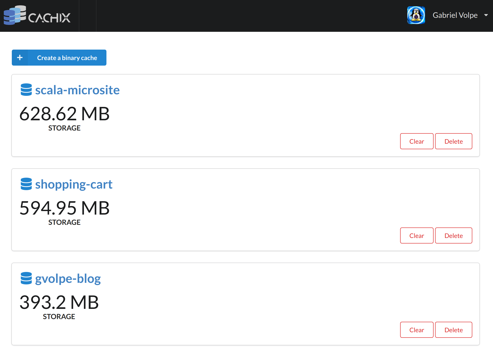

The more I learn about [Nix](https://nixos.org/nix/) - a purely functional package manager - the more I am convinced this is the way forward. Even if there's still room for big improvements.

Today I'd like to share with y'all what I've been up-to lately. Though, you could imagine I've been *Nixifying* more than one project ;)

### Nix shell

Nix shell is a great tool to create reproducible development environments. For example, we could create a shell where the `redis` package is available, without installing it in our system.


$ nix-shell -p redis
[nix-shell:~]$ redis-cli --version
redis-cli 6.0.3
[nix-shell:~]$ exit
exit
$ redis-cli --version
Command 'redis-cli' not found


This is not *that reproducible* since different machines might be pointing to a different Nix channel, or to the same channel but using a different version. To guarantee reproducibility, we need to [pin our nixpkgs](https://nixos.wiki/wiki/FAQ/Pinning_Nixpkgs) version.

Nowadays, it is very common to provide a `shell.nix` per project, declaring the dependencies needed to build it. This comes in very handy since we can checkout a project, type `nix-shell` and we would be ready to build it. Furthermore, one could use [nix-direnv](https://github.com/nix-community/nix-direnv) instead so that all the needed dependencies are available as soon as we cd into the directory (highly recommended).

I've been following this practice in most of my projects, and this blog is not an exception. This is how its `shell.nix` is defined:


let
  nixpkgs = fetchTarball {
    name   = "NixOS-unstable-13-05-2020";
    url    = "https://github.com/NixOS/nixpkgs-channels/archive/6bcb1dec8ea.tar.gz";
    sha256 = "04x750byjr397d3mfwkl09b2cz7z71fcykhvn8ypxrck8w7kdi1h";
  };
  pkgs = import nixpkgs {};

  ruby = pkgs.ruby_2_7;
  rubygems = (pkgs.rubygems.override { ruby = ruby; });

in pkgs.mkShell {
  buildInputs = [
    pkgs.haskellPackages.dhall-json # v1.6.2
    ruby # v2.7.1p83
  ];

  shellHook = ''
    mkdir -p .nix-gems
    export GEM_HOME=$PWD/.nix-gems
    export GEM_PATH=$GEM_HOME
    export PATH=$GEM_HOME/bin:$PATH
  '';
}


If you have never seen one, this is what's happening step by step:

1. `fetchTarball` gets the specified version of the `nixpkgs` as a tarball (reproducibility).
2. `rubygems` is overriding the `ruby` version of `nixpkgs` to match the one we need (`2.7.x`).
2. `pkgs.mkShell` should be self-explanatory; it creates a shell using the specified version of `nixpkgs`.
3. `buildInputs` defines the two dependencies needed to build the project. Actually, only `ruby` is needed to build the blog; `dhall-json` is only used locally to generate some YAML files.
4. `shellHook` allows us to run some commands to prepare the environment of our shell.

Now anyone could clone this project on Github and build it locally using Nix. Reproducibility should be guaranteed (well, mostly(*)).

(*) In a Ruby project, the best way to guarantee reproducibility is by using [bundix](https://github.com/nix-community/bundix), but I didn't bother in using it just to build my blog. After all, I prefer to write code in statically-typed languages.

### Github actions powered by Dhall

The curious reader might be thinking what are those YAML files we need to build. The answer is the YAML files needed by [Github actions](https://help.github.com/en/actions). Why not defining the YAML files directly? One may ask. The answer is I really [dislike YAML files](https://noyaml.com/).

So there is [Dhall](https://dhall-lang.org/), which among other things, can generate YAML from a sane Dhall definition via the `dhall-to-yaml` program. This is how the CI build definition for this blog looks like:


let GithubActions =
      https://raw.githubusercontent.com/gvolpe/github-actions-dhall/steps/cachix/package.dhall sha256:4cd8f64770d8b015c2fd52bae5ddfb5b393eb7e0936f7f8e18f311c591b888a5

let setup =
      [ GithubActions.steps.checkout
      , GithubActions.steps.cachix/install-nix
      , GithubActions.steps.cachix/cachix { cache-name = "gvolpe-blog" }
      , GithubActions.steps.run
          { run = "nix-shell run -- \"bundle install && bundle exec jekyll build\"" }
      ]

in  GithubActions.Workflow::{
    , name = "Blog"
    , on = GithubActions.On::{
      , pull_request = Some GithubActions.PullRequest::{=}
      , push = Some GithubActions.Push::{ branches = Some [ "master" ] }
      }
    , jobs = toMap
        { build = GithubActions.Job::{
          , name = "build"
          , needs = None (List Text)
          , runs-on = GithubActions.types.RunsOn.`ubuntu-18.04`
          , steps = setup
          }
        }
    }


Besides giving us types, Dhall gives us [semantic integrity checks](http://www.haskellforall.com/2017/11/semantic-integrity-checks-are-next.html), which is a great and secure way of versioning files. You should really read the linked blogpost if you haven't heard of it.

Notice how we use the same `shell.nix` we use for local development to build our software in the CI pipeline. Isn't that awesome? No more duplicate ways of building packages! This way, we guarantee that whatever works locally, also works on our CI.

Now, what am I using to write this nice Dhall definition? The answer is [Github Actions Dhall](https://github.com/regadas/github-actions-dhall), a project by Filipe Regadas.

In this particular example, I'm pointing at my fork, which contains the definitions of the `cachix/install-nix` and `cachix/cachix` actions. Ultimately, these changes will be available upstream, I hope.

All we need to do to generate the required YAML file is to run the following command:


$ dhall-to-yaml --file ci.dhall > ci.yml


I know this is a bit annoying at the moment, but I'd do this 1000 times over writing YAML directly. The interesting thing is that Github could support Dhall definitions natively - I actually submitted a feature request but I don't know if they will consider it.

All they need to do is to have `dhall-json` installed, take in a Dhall definition and run the same `dhall-to-yaml` command. Now they can just re-use the existing infrastructure! *It would be fantastic if Github pulls this off*.

### Caching derivations

[Cachix](https://cachix.org/) is a binary cache as a service, and it is free for public caches and open-source projects. It helps speeding up your CI build as well as builds in other machines that share the same `shell.nix`.

Its main documentation is centered around building Nix derivations, so this is what you will find:


$ cachix create <name>
$ nix-build | cachix push <name>
$ cachix use <name>


However, if we try to build our `shell.nix` file, this is what happens:


$ nix-build shell.nix
these derivations will be built:
  /nix/store/7lyp4vfrrsn7rx3rwy31va2l10g4xkxq-nix-shell.drv
building '/nix/store/7lyp4vfrrsn7rx3rwy31va2l10g4xkxq-nix-shell.drv'...
nobuildPhase

This derivation is not meant to be built, aborting

builder for '/nix/store/7lyp4vfrrsn7rx3rwy31va2l10g4xkxq-nix-shell.drv' failed with exit code 1
error: build of '/nix/store/7lyp4vfrrsn7rx3rwy31va2l10g4xkxq-nix-shell.drv' failed


Don't worry. Cachix supports building and pushing the derivations of a Nix shell but it is currently an under-documented feature! This is how we can do it:


$ nix-shell
$ nix-store -qR --include-outputs $(nix-instantiate shell.nix) | cachix push <name>


The first step might not be necessary if you already evaluated your shell or are using Nix Direnv.

Once you learn how to use Cachix, you could take advantage of it on Github actions by using [Cachix Action](https://github.com/cachix/cachix-action), which is the action used in our Dhall file above.

So far, I have been trying this configuration on [this blog](https://github.com/gvolpe/blog), on a [Scala project](https://github.com/profunktor/redis4cats) and on a [Haskell project](https://github.com/gvolpe/shopping-cart-haskell). The conclusion is that for a CI build job I could probably get away without using Cachix and it'll still be the same. However, as soon as the Nix dependencies of your project start to grow, you may notice a difference.

Here's a screenshot of the current size of all the caches I have defined:

### Microsite publishing automation

The Redis4Cats project (Scala) is particularly interesting because I use Nix only to publish the static site (microsite) that contains the documentation. This is normally done via the command `sbt publishMicrosite`, which requires not only `sbt` and `openjdk` but also `jekyll`. Find below the definition of the `shell.nix` file:


let
  nixpkgs = fetchTarball {
    name   = "NixOS-unstable-13-05-2020";
    url    = "https://github.com/NixOS/nixpkgs-channels/archive/6bcb1dec8ea.tar.gz";
    sha256 = "04x750byjr397d3mfwkl09b2cz7z71fcykhvn8ypxrck8w7kdi1h";
  };
  pkgs = import nixpkgs {};
in
  pkgs.mkShell {
    buildInputs = with pkgs; [
      haskellPackages.dhall-json # 1.6.2
      jekyll # 4.0.1
      openjdk # 1.8.0_242
      sbt # 1.3.10
    ];
  }


Besides this Nix shell definition, we also have a Dhall definition of the Github actions job required to automate the publishing of the microsite, only when some changes have been made to the site and is pushed to master.


let GithubActions =
      https://raw.githubusercontent.com/gvolpe/github-actions-dhall/steps/cachix/package.dhall sha256:4cd8f64770d8b015c2fd52bae5ddfb5b393eb7e0936f7f8e18f311c591b888a5

let setup =
      [ GithubActions.steps.checkout
      , GithubActions.steps.cachix/install-nix
      , GithubActions.steps.cachix/cachix { cache-name = "scala-microsite" }
      , GithubActions.steps.run { run = "nix-shell --run \"sbt publishSite\"" }
      ]

in  GithubActions.Workflow::{
    , name = "Microsite"
    , on = GithubActions.On::{
      , push = Some GithubActions.Push::{
        , branches = Some [ "master" ]
        , paths = Some [ "site/**" ]
        }
      }
    , jobs = toMap
        { publish = GithubActions.Job::{
          , name = "publish-site"
          , needs = None (List Text)
          , runs-on = GithubActions.types.RunsOn.`ubuntu-18.04`
          , steps = setup
          , env = Some (toMap { GITHUB_TOKEN = "\${\{ secrets.GITHUB_TOKEN }}" })
          }
        }
    }


You can see it in action [here](https://github.com/profunktor/redis4cats/runs/732431811). It takes about 13 minutes because the `sbt publishMicrosite` is a slow task, not because of Nix, but the point is that this is now an automated task and I can forget about it.

I like all this stuff a lot so I hope to adopt it in other projects quite soon.

Cheers,
Gabriel.
