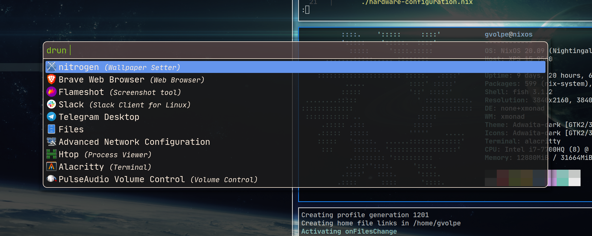

**Table of Contents**

* TOC
{:toc}

### Introduction

I've been a [Gnome](https://www.gnome.org/) user for a long time and I have never cared about using a [Window Manager](https://en.wikipedia.org/wiki/Window_manager) ever before but I recently switched to using [XMonad](https://xmonad.org/) full-time. Why? For a couple of reasons.

One of the reasons is that I've been wanting to try a lightweight window manager for a while. However, the main reason is that Gnome *leaks memory*, unfortunately, and it seems to be an issue that's been around [forever](https://bugs.launchpad.net/gnome-shell/+bug/1672297). Although it has been announced as allegedly solved, I have been experiencing a similar issue in Gnome 3.36 on [NixOS](https://nixos.org/).

After a fresh start, it consumed ~1.2% of my 32GB (about 390MB) but right after 24 hours (only one day of uptime!) I found out it was consuming ~50% (about 16GB!), which is unacceptable. I have screenshots of the memory consumption but I decided to leave them out of this post since it is not about bashing Gnome.

I know writing solid software is hard and memory leaks are one of the toughest problems to solve in Software Engineering so I only want to thank Gnome for all the good years and wish only the best. My mother still uses Gnome 3 with Ubuntu, FWIW :)

The good news is that this incident has pushed me into giving XMonad a serious try, and oh boy, there's no way back! It's like that day I discovered functional programming. How could I ever write imperative code again?

NOTE: If you are already familiar with all of this and are only interested in the configuration files, you can find them on my [Github](https://github.com/gvolpe/nix-config).

### XMonad

XMonad is a dynamically tiling [X11](https://en.wikipedia.org/wiki/X_Window_System) window manager that is written and configured in [Haskell](https://www.haskell.org/). There are many tutorials, blog posts, videos and documentation on the Internet about it so I'm only going to focus on getting XMonad properly set up in NixOS.

This is what it looks like at the moment on my machine (it's always evolving).

That's not only XMonad but also [Polybar](https://polybar.github.io/) and [Picom](https://github.com/yshui/picom) complementing it, a status bar and a compositor, respectively.

If you, like me, come from a popular desktop manager such as Gnome or KDE, you might be surprised finding out all the things they do! Since XMonad is merely a window manager, you won't have out-of-box support for a status bar, notifications, screen locker, etc. This follows the Unix philosophy where we are free to choose how every piece of our software is put together.

In the next sections, we will look into every piece of software I have configured to get the full desktop manager experience.

#### Configuration

I configure all my software and user services via [Home Manager](https://github.com/nix-community/home-manager), an amazing Nix tool. It's great on NixOS but it also works in other Linux distros, if you want to give it a shot.

However, some programs and services need to be declared at the system level, which is also the case for XMonad. So we will start with it.

All configuration files live under `/etc/nixos/` and `~/.config/nixpkgs/` for system-level configuration and user-level configuration, respectively. Therefore, only the relative path will be mentioned in the following sections.

##### System level

I've defined the XMonad system configuration under `wm/xmonad.nix`, and I've done pretty much the same with my Gnome configuration, so it would be easy to switch between both.


{ config, lib, pkgs, ... }:

{
  services = {
    gnome3.gnome-keyring.enable = true;
    upower.enable = true;

    dbus = {
      enable = true;
      socketActivated = true;
      packages = [ pkgs.gnome3.dconf ];
    };

    xserver = {
      enable = true;
      startDbusSession = true;
      layout = "us";

      libinput = {
        enable = true;
        disableWhileTyping = true;
      };

      displayManager.defaultSession = "none+xmonad";

      windowManager.xmonad = {
        enable = true;
        enableContribAndExtras = true;
      };

      xkbOptions = "caps:ctrl_modifier";
    };
  };

  hardware.bluetooth.enable = true;
  services.blueman.enable = true;

  systemd.services.upower.enable = true;
}


There is a lot declared in this file that is completely unrelated to it but that complements it.

- `gnome3.gnome-keyring`: needed to store credentials such as WiFi passwords, so we don't need to enter it every time we log in.
- `upower`: get system's power information such as CPU usage. We also need the `systemd` daemon.
- `dbus`: short for Desktop Bus, allows concurrent communication between multiple processes and it's kind of ubiquitous these days.
- `bluetooth`: enable bluetooth.
- `blueman`: enable the bluetooth manager service.

For what it's worth, all of these are enabled by default when using either Gnome or KDE.

The rest of the configuration is part of `xserver`, in which case, we need to highlight the default session of our display manager being set to `none+xmonad` and enabling XMonad as our window manager. The `none` part means we don't want any Desktop Environment (DE), which defaults to `xfce` in NixOS, if I'm not mistaken.

This file is then imported at `configuration.nix`, which is the main NixOS configuration file.


{
  imports =
    [
      # Include the results of the hardware scan.
      ./hardware-configuration.nix
      # Machine-specific configuration
      ./machine/current.nix
      # Window manager
      ./wm/xmonad.nix
    ];
}


A regular `nixos-rebuild switch` followed by a `reboot` are needed for all these changes to become active.

##### User level

User-level configuration includes all the dotfiles that usually live under `$HOME/.config` as well as user-level services managed via `systemctl`. This is the perfect fit for Home Manager (HM). For reference, this is how the files are organized.


.
├── config.nix
├── home.nix
├── overlays
├── programs
│   ├── alacritty
│   ├── browsers
│   ├── fish
│   ├── git
│   ├── neovim
│   ├── rofi
│   └── xmonad
├── services
│   ├── dunst
│   ├── gpg-agent
│   ├── networkmanager
│   ├── picom
│   ├── polybar
│   ├── screenlocker
│   └── udiskie
└── unstable.nix


Every folder has a `default.nix` we import in `home.nix`. So, for example, the configuration for XMonad lives under `programs/xmonad/default.nix`, and so on. Its definition is shown below.


{
  xsession = {
    enable = true;

    initExtra = polybarOpts;

    windowManager.xmonad = {
      enable = true;
      enableContribAndExtras = true;
      extraPackages = hp: [
        hp.dbus
        hp.monad-logger
        hp.xmonad-contrib
      ];
      config = ./config.hs;
    };
  };
}


We will later see how `polybarOpts` is defined and whether that's needed for you or not. This file is then imported by `home.nix`, in the same way we do it at the system level.


{ config, lib, pkgs, stdenv, ... }:

{
  programs.home-manager.enable = true;

  imports = [
    ./programs/xmonad/default.nix
  ];
}


In general, all the programs and user-level services are imported in this way, to keep the modularity.

### Rofi

Right after XMonad is installed, having an application launcher (recommended) might be very convenient to have. Otherwise, the only way to run applications will be directly from a terminal, which is not the nicest experience for GUI programs. This is where tools such as [dmenu](https://tools.suckless.org/dmenu/) and [Rofi](https://github.com/davatorium/rofi) come into place.

The former has been around for a long time and it's a good default but after trying out both, I've settled for Rofi, which is a modern replacement for `dmenu`. You can customize its look and feel as you please and there are a few themes to select from if you prefer something already made.

Here's how it looks on my machine.

I use a customized version of the [Arthur theme](https://github.com/davatorium/rofi/blob/next/themes/arthur.rasi). Here's how to import it using Home Manager.


{ pkgs, ... }:

{
  programs.rofi = {
    enable = true;
    terminal = "${pkgs.alacritty}/bin/alacritty";
    theme = ./theme.rafi;
  };
}


### Polybar

When I got started with XMonad, I've tried [XMobar](https://xmobar.org/) first, which is the default status bar you would see recommended for this window manager. Later on, I gave [taffybar](https://github.com/taffybar/taffybar) a try, but it was a bit painful to set up since I needed to add two Nix overlays to get it working as it is usually marked as broken on Nixpkgs.

Both of them work fine and might suit your needs (I still keep the configuration files for both in my repo, if you're interested) but I ultimately fell in love with [Polybar](https://polybar.github.io/). I am actually running two instances of it: one at the top; another at the bottom. There are many existing themes, great documentation and a vibrant community behind it, which makes it even more appealing.

It is configured via [INI files](https://en.wikipedia.org/wiki/INI_file). Here's a snippet.


[global/wm]
margin-top = 0
margin-bottom = 0

[bar/main]
monitor = ${env:MONITOR:HDMI-1}
width = 100%
height = 48
radius = 6.0
fixed-center = true


It comes packed with a few modules by default such as CPU, memory and network status. However, some modules might require some software to be available in your system. I'll leave that for you to further read and instead I'll show you the important part:

- XMonad integration to visualize the current window title and workspaces.
- Dealing with modules that require custom scripts doing it the Nix way.

Here's my configuration, which runs as a service you can manage via `systemctl`.


{ config, pkgs, ... }:

let
  mypolybar = pkgs.polybar.override {
    alsaSupport   = true;
    githubSupport = true;
    mpdSupport    = true;
    pulseSupport  = true;
  };

  # theme adapted from: https://github.com/adi1090x/polybar-themes#-polybar-5
  bars   = builtins.readFile ./bars.ini;
  colors = builtins.readFile ./colors.ini;
  mods1  = builtins.readFile ./modules.ini;
  mods2  = builtins.readFile ./user_modules.ini;

  mprisScript     = pkgs.callPackage ./scripts/mpris.nix {};

  mpris = ''
    [module/mpris]
    type = custom/script

    exec = ${mprisScript}/bin/mpris
    tail = true

    label-maxlen = 60

    interval = 2
    format =   <label>
    format-padding = 2
  '';

  xmonad = ''
    [module/xmonad]
    type = custom/script
    exec = ${pkgs.xmonad-log}/bin/xmonad-log

    tail = true
  '';
in
{
  services.polybar = {
    enable = true;
    package = mypolybar;
    config = ./config.ini;
    extraConfig = bars + colors + mods1 + mods2 + mpris + xmonad;
    script = ''
      polybar top &
      polybar bottom &
    '';
  };
}


As mentioned above, I'm running two different bars, as the `script` section shows.

For the XMonad integration, we only need to add `[module/xmonad]`. If we were not using Nix, this could have been defined in the INI files but since we are on NixOS, we do it properly by referencing the binary we want to run from this module, which is `xmonad-log`. We also need to do our part in our XMonad configuration, to make sure it sends out information via DBus.

This is most of the code. You can find the complete configuration on my [Github](https://github.com/gvolpe/nix-config/blob/master/home/programs/xmonad/config.hs).


mkDbusClient :: IO D.Client
mkDbusClient = do
  dbus <- D.connectSession
  D.requestName dbus (D.busName_ "org.xmonad.log") opts
  return dbus
 where
  opts = [D.nameAllowReplacement, D.nameReplaceExisting, D.nameDoNotQueue]

-- Emit a DBus signal on log updates
dbusOutput :: D.Client -> String -> IO ()
dbusOutput dbus str =
  let opath  = D.objectPath_ "/org/xmonad/Log"
      iname  = D.interfaceName_ "org.xmonad.Log"
      mname  = D.memberName_ "Update"
      signal = (D.signal opath iname mname)
      body   = [D.toVariant $ UTF8.decodeString str]
  in  D.emit dbus $ signal { D.signalBody = body }

polybarHook :: D.Client -> PP
polybarHook dbus =
  let wrapper c s | s /= "NSP" = wrap ("%{F" <> c <> "} ") " %{F-}" s
                  | otherwise  = mempty
      blue   = "#2E9AFE"
      gray   = "#7F7F7F"
      orange = "#ea4300"
      purple = "#9058c7"
      red    = "#722222"
  in  def { ppOutput          = dbusOutput dbus
          , ppCurrent         = wrapper blue
          , ppVisible         = wrapper gray
          , ppUrgent          = wrapper orange
          , ppHidden          = wrapper gray
          , ppHiddenNoWindows = wrapper red
          , ppTitle           = shorten 100 . wrapper purple
          }

myPolybarLogHook dbus = myLogHook <+> dynamicLogWithPP (polybarHook dbus)


Now for other custom scripts, you can do the same. Above we see `[module/mpris]`, which is a shell script that reads the current song being played via `playerctl`. It is also defined the Nix way, as shown below.


{ pkgs, ...}:

let
  pctl = "${pkgs.playerctl}/bin/playerctl";
in
  pkgs.writeShellScriptBin "mpris" ''
    echo $(${pctl} --player=spotify,%any metadata --format '{{ artist }} - {{ title }}')
  ''


Another important setting you might need, depending on your modules, is to add a proper font and icons package to your user packages. This is what I have, for example.


let
  polybarPkgs = with pkgs; [
    font-awesome-ttf      # awesome fonts
    material-design-icons # fonts with glyphs
  ];
in
  home.packages = polybarPkgs;


### Dunst

[Dunst](https://dunst-project.org/) is a lightweight replacement for the notification daemons provided by most desktop environments. It's very customizable, isn't dependent on any toolkits, and therefore fits into those window manager centric setups we all love to customize to perfection.

That's a quote from the official site. It also runs a service, and here's a snippet showing how it is integrated via Home Manager.


{ config, pkgs, ... }:

{
  services.dunst = {
    enable = true;
    iconTheme = {
      name = "Adwaita";
      package = pkgs.gnome3.adwaita-icon-theme;
      size = "16x16";
    };
    settings = {
      global = {
        monitor = 0;
        geometry = "600x50-50+65";
        shrink = "yes";
        transparency = 10;
        padding = 16;
        horizontal_padding = 16;
        font = "JetBrainsMono Nerd Font 10";
        line_height = 4;
        format = ''<b>%s</b>\n%b'';
      };
    };
  };
}


I haven't tried any other notification system and I haven't been made aware of a better choice but if you do, please let me know. I always like to try new things.

### Betterlockscreen

If you want to configure a screen locker, you'll find there are quite a few alternatives out there, with [i3lock](https://i3wm.org/i3lock/) being probably the most popular option. I've tried a few variants of it but I finally settled for [betterlockscreen](https://github.com/pavanjadhaw/betterlockscreen), which is also built on top of `i3lock`.

It runs as a service as well. Here's my configuration, without much further ado.


{ pkgs, ... }:

{
  services.screen-locker = {
    enable = true;
    inactiveInterval = 30;
    lockCmd = "${pkgs.betterlockscreen}/bin/betterlockscreen -l dim";
    xautolockExtraOptions = [
      "Xautolock.killer: systemctl suspend"
    ];
  };
}


### Picom

What exactly is a compositor? According to [Wikipedia](https://en.wikipedia.org/wiki/Compositing_window_manager), a compositing window manager, or compositor, is a window manager that provides applications with an off-screen buffer for each window. The window manager composites the window buffers into an image representing the screen and writes the result into the display memory.

[picom](https://github.com/yshui/picom) is probably the indisputable default these days, which is a fork of `compton`, which is also a fork of the original `xcompmgr`, both "retired" projects.

It shouldn't come as a surprise that it also runs a service. Here's my configuration.


{
  services.picom = {
    enable = true;
    activeOpacity = "1.0";
    inactiveOpacity = "0.8";
    backend = "glx";
    fade = true;
    fadeDelta = 5;
    opacityRule = [ "100:name *= 'i3lock'" ];
    shadow = true;
    shadowOpacity = "0.75";
  };
}


### System tray

If you use programs like Slack or Telegram, you might appreciate a system tray for them. This is something we also need to take care about. When using XMobar or Taffybar, people usually go for [standalonetray](http://stalonetray.sourceforge.net/), which is fairly basic. Conversely, Polybar users don't need to worry about it as it comes with a nice system tray by default.

The configuration for my system tray is fairly basic. I keep it in the center of my top bar.


tray-padding = 3
tray-background = ${color.bg}
tray-detached = false
tray-maxsize = 6
tray-offset-x = 0
tray-offset-y = 0
tray-padding = 0
tray-scale = 1.0

[bar/top]
inherit = bar/main
tray-position = center

[bar/bottom]
inherit = bar/main
bottom = true
tray-position = none


At the beginning of the user level section, I briefly mentioned the use of `polybarOpts` as an option to `xsession.initExtra`.  This is how it is defined.


polybarOpts = ''
  nitrogen --restore &
  pasystray &
  blueman-applet &
  nm-applet --sm-disable --indicator &
'';


I basically start up some utilities that run in the system tray such as Pulse Audio (`pasystray`), Bluetooth Manager (`blueman-applet`) and Network Manager (`nm-applet`). There's also `nitrogen` to restore my wallpaper. Some other folks prefer to use [feh](https://feh.finalrewind.org/). I would use any of them, to be fair, no big preferences.

It might also be relevant to set up a GTK theme. This is what I have defined in my `home.nix`.


gtk = {
  enable = true;
  iconTheme = {
    name = "Adwaita-dark";
    package = pkgs.gnome3.adwaita-icon-theme;
  };
  theme = {
    name = "Adwaita-dark";
    package = pkgs.gnome3.adwaita-icon-theme;
  };
};


### Udiskie

Since we talked about our system tray, there's also [udiskie](https://github.com/coldfix/udiskie), which is quite popular. It shows information about removable media and it automounts them by default.

We could have started up as part of our XSession but since Home Manager supports running it as a service, I went with it.


{
  services.udiskie = {
    enable = true;
    tray = "always";
  };
}


Home Manager also supports starting up the [Network Manager applet](https://rycee.gitlab.io/home-manager/options.html#opt-services.network-manager-applet.enable) as a service but at the moment of writing, it doesn't support customized flags, so I run it manually in my XSession.

### Conclusion

Wow, we went through a lot of stuff! This is actually a big part of my current NixOS configuration. I hope you have enjoyed the details since when I started playing around with all of it, the information was pretty much scattered around the Internet and I had to figure out a lot of things by trial and error.

These settings will probably keep on changing but I'm already in a very comfortable place with my current configuration so I don't expect drastic changes in the near future but rather small improvements.

My full NixOS configuration, including the programs and services managed by Home Manager, can be found on [Github](https://github.com/gvolpe/nix-config).

Cheers,
Gabriel.
