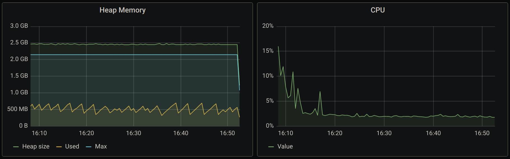
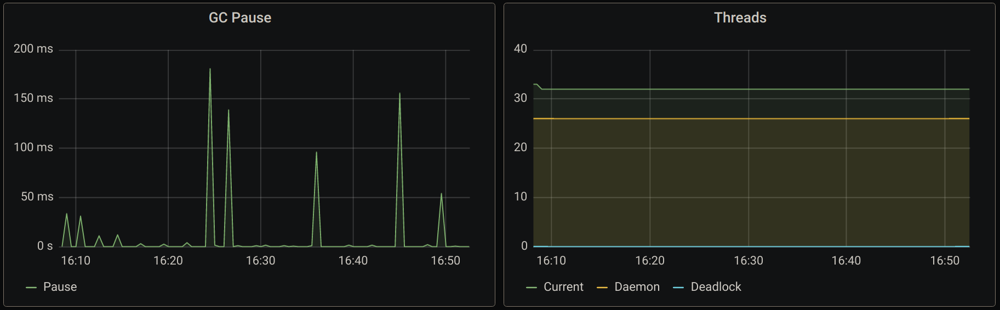

As the title says, finite-state machines and Fs2 streams are a match made in heaven! To demonstrate it, I'll make up a compelling problem to solve and we will get to the final solution step by step. Here's a sneak-peek of the solution.


trait Ticker[F[_]] {
  def get: F[Tick]
  def merge(timerTick: Tick, count: Count): F[(Tick, Count)]
  def ticks: Stream[F, Tick]
}

case class Engine[F[_]: Concurrent: Parallel: Time: Timer](
    publish: Summary => F[Unit],
    ticker: Ticker[F]
) {
  private val fsm = Engine.fsm[F](ticker)

  def run: Pipe[F, Event, Unit] =
    _.noneTerminate
      .zip(ticker.ticks)
      .evalMapAccumulate(Map.empty[PlayerId, Agg] -> 0)(fsm.run)
      .collect { case (_, (out, Tick.On)) => out }
      .evalMap { m =>
        F.timestamp.flatMap { ts =>
          m.toList.parTraverse_ {
            case (pid, agg) => publish(agg.summary(pid, ts))
          }
        }
      }
}


Interested in seeing more? Continue reading or browse the [source code](https://github.com/gvolpe/fsm-streams) on your own :)

### Problem

We have an adventure game called "Streaming Adventures" where a single player is the main star. A new player starts up at level zero and score zero, and it can only win once level 50 has been cleared. This is how we will model the domain in Scala.


case class Game(
  playerId: PlayerId, // UUID
  playerScore: PlayerScore, // Int
  level: Level, // Int
  gems: Map[GemType, Int]
)

case class Player(
  id: PlayerId, // UUID
  highestScore: PlayerScore, // Int
  gems: Map[GemType, Int],
  memberSince: Timestamp // Instant
)

sealed trait GemType
object GemType {
  case object Diamond  extends GemType
  case object Emerald  extends GemType
  case object Ruby     extends GemType
  case object Sapphire extends GemType
}


*NOTE: For conciseness, newtypes such as `PlayerId` and `Level` will be omitted on this post but you can find them in the corresponding [repository](https://github.com/gvolpe/fsm-streams).*

The score can be raised by either collecting gems or solving different puzzles along the way, as well as leveling up. We will model it as an event-driven system with three possible events.


sealed trait Event {
  def createdAt: Timestamp
}

object Event {
  case class LevelUp(
    playerId: PlayerId,
    newLevel: Level,
    createdAt: Timestamp
  ) extends Event

  case class PuzzleSolved(
    playerId: PlayerId,
    puzzleName: PuzzleName,
    duration: FiniteDuration,
    createdAt: Timestamp
  ) extends Event

  case class GemCollected(
    playerId: PlayerId,
    gemType: GemType,
    createdAt: Timestamp
  ) extends Event
}


Let's pretend the game's logic has been completed and the game is already playable. Our job is to calculate both the **player's score** and to keep track of the amount of **collected gems** (grouped by type) based on the events defined above. Here's a table showing how many points an event is worth it.


╔══════════════╦════════╗
║    Event     ║ Points ║
╠══════════════╬════════╣
║ GemCollected ║   10   ║
║ PuzzleSolved ║   50   ║
║ LevelUp      ║   100  ║
╚══════════════╩════════╝


Another important point to consider is that all these requirements are solely for analytics purposes for all players and concurrent games.

### Solution

We are going to solve it by aggregating all the incoming events, grouped by `PlayerId`, within a given time window or a certain amount of processed events, and then emit a `Summary` that will be processed downstream. We could probably solve it by only using a time window, though, by considering the number of processed events, we can limit how much memory we use.

As you have seen at the beginning of this post, the solution involves an aggregation datatype and a finite-state machine, so these are the ones we will analyze first.


evalMapAccumulate(Map.empty[PlayerId, Agg] -> 0)(fsm.run)


#### Aggregation datatype

Without further ado, here's the definition of `Agg`, a simple datatype used for data aggregation.


import monocle.macros._

case class Agg(
    level: Level,
    points: Points,
    gems: Map[GemType, Int]
) {
  def summary(pid: PlayerId, ts: Timestamp): Summary =
    Summary(pid, level, points, gems, ts)
}

object Agg {
  def empty = Agg(Level(0), Points(0), Map.empty)

  val _Gems   = GenLens[Agg](_.gems)
  val _Level  = GenLens[Agg](_.level)
  val _Points = GenLens[Agg](_.points)
}


It also comes packed with a bunch of useful lenses and convenient functions.

#### Finite-state machine

Quoting the [Wikipedia](https://en.wikipedia.org/wiki/Finite-state_machine):

"A finite-state machine (FSM) or finite-state automaton (FSA, plural: automata), finite automaton, or simply a state machine, is a mathematical model of computation. It is an abstract machine that can be in exactly one of a finite number of states at any given time. The FSM can change from one state to another in response to some inputs; the change from one state to another is called a transition. An FSM is defined by a list of its states, its initial state, and the inputs that trigger each transition. Finite-state machines are of two types—deterministic finite-state machines and non-deterministic finite-state machines. A deterministic finite-state machine can be constructed equivalent to any non-deterministic one."

Here's how we can possibly define it in Scala, which is the implementation we will be using further down.


case class FSM[F[_], S, I, O](run: (S, I) => F[(S, O)])


Breaking it down:

- `F[_]`: a higher-kinded type.
- `S`: the possible states this machine can be in at a given time.
- `I`: the input type.
- `O`: the output type.

Finally, the `run` function represents the **transition** from a given state and input to another state and output, in the context of `F`. For example, a pure state-machine can be defined using the identity monad.


import cats.Id

object FSM {
  def identity[S, I, O](run: (S, I) => Id[(S, O)]) = FSM(run)
}


To solve our problem, we will use a [Mealy State Machine](https://en.wikipedia.org/wiki/Mealy_machine), which is a specific kind of FSM whose output values are determined both by its current state and the current inputs. Finite-state machines hold many other different properties but I'll leave this great topic for another day. Right now, we have all we need to solve the problem at hand.

Let's see how we can represent all the valid state transitions for our use case by using our `FSM`.


type Result = (Map[PlayerId, Agg], Tick)
type State  = (Map[PlayerId, Agg], Count)

def fsm[F[_]: Applicative](
    ticker: Ticker[F]
): FSM[F, State, (Option[Event], Tick), Result] = FSM {
  case ((m, count), (Some(event), tick)) =>
    val (playerId, modifier) =
      event match {
        case Event.LevelUp(pid, level, _) =>
          pid -> _Points.modify(_ + 100).andThen(_Level.set(level))
        case Event.PuzzleSolved(pid, _, _, _) =>
          pid -> _Points.modify(_ + 50)
        case Event.GemCollected(pid, gemType, _) =>
          pid -> _Points.modify(_ + 10).andThen {
            _Gems.modify(_.updatedWith(gemType)(_.map(_ + 1).orElse(Some(1))))
          }
      }
    val agg = m.getOrElse(playerId, Agg.empty)
    val out = m.updated(playerId, modifier(agg))
    val nst = if (tick === Tick.On) Map.empty[PlayerId, Agg] else out

    ticker.merge(tick, count).map {
      case (newTick, newCount) =>
        (nst -> newCount) -> (out -> newTick)
    }
  case ((m, _), (None, _)) =>
    F.pure((Map.empty -> 0) -> (m -> Tick.On))
}


Focus on the state transitions. In the first case, we get `Some(event)` and then proceed to pattern-match on the `Event`. We increase the points accordingly, and in specific cases, we modify some other properties. Lastly, we emit the new state and ouput. You can ignore the `ticker.merge` part for now, only know that it's managing the ticks either by time-window or a certain number of processed events. We will get into the `Ticker` implementation soon.

The last case requires a bit more of explanation. Because the input type of our FSM is `(Option[Event], Tick)`, we need to consider the `None` case, which means our input data has come to an end in a streaming context (more on this soon).

A great property of finite-state machines is that they contain pure logic and can be tested in isolation. So let's do that first before moving on.


test("FSM specification") {
  forAll(genGemCollected, genPuzzleSolved, genLevelUp) { (e1, e2, e3) =>
    val (st1 @ (res1, count1), (out1, tick1)) = fsm.run((Map.empty -> 0), (Some(e1) -> Tick.Off))
    assertEquals(count1, 1)
    assertEquals(tick1, Tick.Off)
    assertEquals(out1, res1)
    assertEquals(gems(res1), 1)
    assertEquals(level(res1), 0)
    assertEquals(points(res1), 10)

    val (st2 @ (res2, count2), (out2, tick2)) = fsm.run(st1, (Some(e2) -> Tick.Off))
    assertEquals(count2, 2)
    assertEquals(tick2, Tick.Off)
    assertEquals(out2, res2)
    assertEquals(gems(res2), 1)
    assertEquals(level(res2), 0)
    assertEquals(points(res2), 60)

    val (st3 @ (res3, count3), (out3, tick3)) = fsm.run(st2, (Some(e3) -> Tick.Off))
    assertEquals(count3, 3)
    assertEquals(tick3, Tick.Off)
    assertEquals(out3, res3)
    assertEquals(gems(res3), 1)
    assertEquals(level(res3), e3.newLevel.value)
    assertEquals(points(res3), 160)

    // at the end of the stream, both the counter and the tick timer are reseted
    val (st4 @ (res4, count4), (out4, tick4)) = fsm.run(st3, (None -> Tick.Off))
    assertEquals(count4, 0)
    assertEquals(tick4, Tick.On)
    assert(res4.isEmpty)
    assertEquals(gems(out4), 1)
    assertEquals(level(res4), 0)
    assertEquals(points(out4), 160)

    val ((res5, count5), (out5, tick5)) = fsm.run(st4, (Some(e1) -> Tick.Off))
    assertEquals(count5, 1)
    assertEquals(tick5, Tick.Off)
    assertEquals(out5, res5)
    assertEquals(gems(res5), 1)
    assertEquals(level(res5), 0)
    assertEquals(points(res5), 10)
  }
}


Let's break it apart.

1. We run our FSM with an initial empty state and our first event: `GemCollected`. Once we get the result, we run a few assertions on it. The two most important ones are that the total number of gems equals one and the total amount of points equals ten.
2. We run our FSM with the previous state, namely `st1`, and a second event: `PuzzleSolved`. The procedure is mostly the same. The most important assertions are that we still keep the previous gem and that our points have been increased to sixty.
3. We run our FSM with the previous state, namely `st2`, and a third event: `LevelUp`. In addition to the previous assertions, we also verify that a new level has been set.
4. We run our FSM with the previous state, namely `st3`, and no event (`None`). In addition to the previous assertions, we also verify that counter has been reseted and the tick is now on.
5. Lastly, we run our FSM with the previous state, namely `st4`, and the first event once again: `GemCollected`. The assertion is now identical to our first case.

You can find more unit tests for our FSM in the [repository](https://github.com/gvolpe/fsm-streams).

#### Streaming

If we give it a closer look, we will recognize the type signature of [mapAccumulate](https://github.com/typelevel/fs2/blob/v2.4.5/core/shared/src/main/scala/fs2/Stream.scala#L1705) as a finite-state machine lifted into a streaming context.


def mapAccumulate[S, O2](init: S) (f: (S, O) => (S, O2)): Stream[F, (S, O2)]


There's also `evalMapAccumulate` for dealing with effectful state transitions, which is the one we will be using in our solution. Let's bring it up again and describe each step in detail.


case class Engine[F[_]: Concurrent: Parallel: Time: Timer](
    publish: Summary => F[Unit],
    ticker: Ticker[F]
) {
  private val fsm = Engine.fsm[F](ticker)

  def run: Pipe[F, Event, Unit] =
    _.noneTerminate
      .zip(ticker.ticks)
      .evalMapAccumulate(Map.empty[PlayerId, Agg] -> 0)(fsm.run)
      .collect { case (_, (out, Tick.On)) => out }
      .evalMap { m =>
        F.timestamp.flatMap { ts =>
          m.toList.parTraverse_ {
            case (pid, agg) => publish(agg.summary(pid, ts))
          }
        }
      }
}


To begin with, we have a `Pipe[F, Event, Unit]`, which is merely an alias for a function `Stream[F, Event] => Stream[F, Unit]`. Firstly, we call `noneTerminate`, which will lift our `Event` into an `Option[Event]`, giving us a `Stream[F, Option[Event]]`. The reason for doing so, is that we want to accumulate and aggregate events in memory before emitting a summary but, in case the stream terminates, that last aggregation won't be emitted. So we handle this case with the `None` case in our state machine.

Next, we `zip` our input with the output of a `Stream[F, Tick]`, yielding a `Stream[F, (Option[Event], Tick)]`. This is effectively the input type of our state machine. A tick will be produced either when the given time window has passed or when the number of processed events has been reached, whichever happens first. We will later dive into the `Ticker` implementation.

Continuing, we `evalMapAccumulate` with an initial state: an empty map and counter set to zero. As mentioned before, both `mapAccumulate` and `evalMapAccumulate` fit the type signature of a finite-state machine, so here we call `fsm.run`. These events will be aggregated in memory until our tick becomes `Tick.On`.

Which takes us to `collect { case (_, (out, Tick.On)) => out }`. The current aggregation will be only emitted when we get a tick.

Finally, we create a timestamp - which comes from a custom `Time` interface - and proceed to publish a `Summary` for every player, by using the given `publish` function.

#### Boolean blindness

`Tick` is a simple datatype used to avoid [boolean blindness](https://runtimeverification.com/blog/code-smell-boolean-blindness/). However, it also forms a `Semigroup`. In the next section, you will understand how this is useful.


import cats.{Eq, Semigroup}

sealed trait Tick
object Tick {
  case object On  extends Tick
  case object Off extends Tick

  implicit val eq: Eq[Tick] = Eq.fromUniversalEquals

  implicit val semigroup: Semigroup[Tick] =
    new Semigroup[Tick] {
      def combine(x: Tick, y: Tick): Tick = (x, y) match {
        case (On, _)    => On
        case (_, On)    => On
        case (Off, Off) => Off
      }
    }
}


#### Ticker

Fs2 provides a function named [every](https://github.com/typelevel/fs2/blob/v2.5.0/core/shared/src/main/scala/fs2/Stream.scala#L3187), which constantly emits a tick expressed as a `boolean`. Whenever the specified duration is reached, it evaluates to `true`. Otherwise, it evaluates to `false`. However, we can't make use of it because we also need to consider the number of events that have been processed so far. Whatever happens first, both the tick's timer and the events counter need to be reseted. Here's where our custom `Ticker` comes into play.


trait Ticker[F[_]] {
  def get: F[Tick]
  def merge(timerTick: Tick, count: Count): F[(Tick, Count)]
  def ticks: Stream[F, Tick]
}

object Ticker {
  type Count = Int

  def create[F[_]: Concurrent: Timer](
      maxNrOfEvents: Int,
      timeWindow: FiniteDuration
  ): F[Ticker[F]] =
    Ref.of[F, Tick](Tick.Off).map { ref =>
      new Ticker[F] {
        def get: F[Tick] = ref.get

        def merge(timerTick: Tick, count: Count): F[(Tick, Count)] =
          ref
            .modify {
              case Tick.Off if count === maxNrOfEvents => Tick.On  -> 0
              case _ if timerTick === Tick.On          => Tick.Off -> 0
              case _                                   => Tick.Off -> (count + 1)
            }
            .flatMap { newCount =>
              get.map { counterTick =>
                val newTick = counterTick |+| timerTick
                newTick -> newCount
              }
            }

        def ticks: Stream[F, Tick] = {
          val duration = timeWindow.toNanos
          val interval = FiniteDuration((timeWindow.toSeconds * 0.05).toLong, SECONDS).toNanos

          def go(lastSpikeNanos: Long): Stream[F, Tick] =
            Stream.eval((F.monotonic(NANOSECONDS), get).tupled).flatMap {
              case (now, tick) =>
                if ((now - lastSpikeNanos) > duration || (tick === Tick.On && (now - lastSpikeNanos) > interval))
                  Stream.emit(Tick.On) ++ go(now)
                else Stream.emit(Tick.Off) ++ go(lastSpikeNanos)
            }

          go(0).tail
        }
      }
    }
}


In the [Github repository](https://github.com/gvolpe/fsm-streams), you will also find scaladocs on each method and unit tests for this implementation. Though, in the meantime, let's analyze each function.

Our first function, `get`, is the simplest one. It retrieves the current state of the counter tick.

Next, we have `merge`, which takes a timer tick and a count and returns a tuple `(Tick, Count)`, possibly running some effects. In a nutshell, this function is the responsible for resetting both the counter and time ticks, as well as keeping track of the count. Ultimately, the tick response we get is the result of the combination of the counter tick and the timer tick by relying on the `Semigroup[Tick]` instance we've seen before.

Finally, our `ticks` function is the analog to the `Stream.every` function that also considers the current state of the counter ticks. It also emits a `Tick` instead of a `boolean`.

### Credits

Initially, my first solution was based on `evalMapAccumulate` + `debounce` + `Ref` but after asking for feedback, [Emrys Ingersoll](https://github.com/wemrysi) came up with a solution based on `noneTerminate` + `mapAccumulate` + `collect`, which is the one I used for the final solution so credits where due, thanks again Emrys!

### Summary

This was a really fun problem to solve! I hope you have enjoyed reading about it. As a bonus track, here are some graphics showing how this performs under heavy load of events coming in from an Apache Pulsar topic.

I can't disclose more information than you can see in these JVM metrics but the GC pauses are interesting to observe, which makes sense given that we allocate quite a lot of objects in memory during the aggregation time window.

Cheers,
Gabriel.
