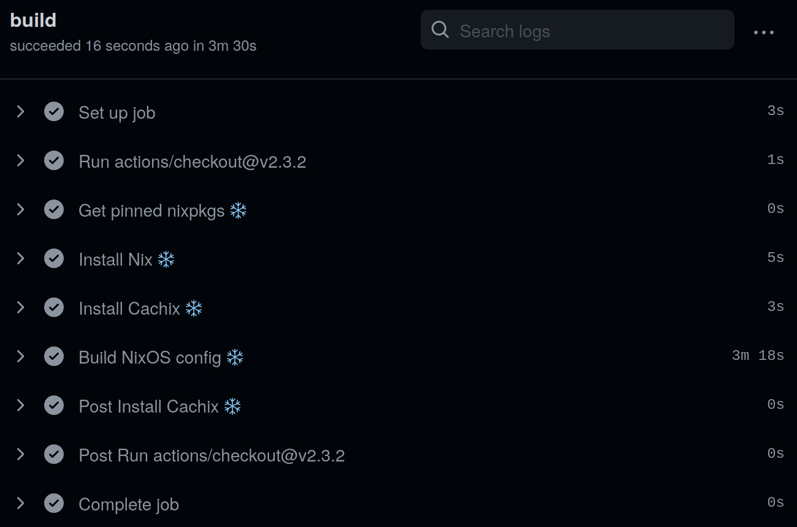

What if I told you that you can save plenty of time and CPU-power by pre-building your *entire* [NixOS](https://nixos.org/) configuration on Github actions? Fresh installations could be super fast and pre-validated on a CI build!

Well, it's possible, and it's what I'm [currently doing](https://github.com/gvolpe/nix-config) with my NixOS and [Home Manager](https://github.com/nix-community/home-manager) configurations.

Besides hosting your configuration on Github, you'll need a binary cache where the results of your build can be pushed to be re-used later on. One of the best free alternatives is [Cachix](https://www.cachix.org/), offering up to 10GB on their basic tier.

### Home Manager

My Home Manager configuration builds in about 5 minutes.

Here's the CI job definition for my home configuration.


jobs:
  build:
    runs-on: ubuntu-18.04
    steps:
      - uses: actions/checkout@v2.3.2

      - name: "Get pinned nixpkgs ❄️"
        id: pinned_nixpkgs
        run: echo "::set-output name=url::$(cat ./pinned/nixpkgs)"

      - name: "Install Nix ❄️"
        uses: cachix/install-nix-action@v13
        with:
          nix_path: "nixpkgs=$\{\{ steps.pinned_nixpkgs.outputs.url \}}"

      - name: "Install Cachix ❄️"
        uses: cachix/cachix-action@v10
        with:
          name: gvolpe-nixos
          authToken: "$\{\{ secrets.CACHIX_AUTH_TOKEN \}}"

      # Needed because cachix is also installed by Home Manager
      - name: "Set priority flag for Cachix 🚩"
        run: nix-env --set-flag priority 0 cachix

      - name: "Build Home Manager config 🏠"
        run: ./build.sh ci-home


The first relevant part is the reading of the pinned nixpkgs file, which looks as follows:


$ cat pinned/nixpkgs
───────┬──────────────────────────────────────────────────────────────
       │ File: pinned/nixpkgs
───────┼──────────────────────────────────────────────────────────────
   1   │ https://github.com/NixOS/nixpkgs/archive/8ecc61c91a5.tar.gz


This is then read to install Nix with this specific version.

The second relevant part is the priority flag for Cachix. This is needed in my case, because my Home Manager configuration includes Cachix as one of the programs to install, but we already have it as part of the `cachix-action`, so we give it the priority before proceeding with the build.

Next, the shell script does the following (in addition to the creation of some directories specific to my needs):


$ nix-shell -p nix-build-uncached --run nix-build-uncached


The [nix-build-uncached](https://github.com/Mic92/nix-build-uncached) command saves time by not re-building what's already present in the binary cache, which cuts about 1 minute of building time, in this case.

It mostly accepts the same arguments as `nix-build`, so you can use it wherever you use the former. If you're familiar with it, you know it needs a `default.nix` at the root directory, if no file name is indicated. This is where it gets interesting, because we usually build our home configuration by running `home-manager switch`, so there's no such file!

Fortunately for us, it is possible to get a derivation out of Home Manager. First of all, we define a `default.nix` with two attributes.


{ pkgs ? import <nixpkgs> {
    config = { allowUnfree = true; };
  }
}:

{
  home = pkgs.callPackage ./home {};
  system = pkgs.callPackage ./system {};
}


This will allow us to build all the attributes, or just the one we are interested in. E.g.


nix-build-uncached -A home


At last, here's the derivation for Home Manager, placed under `home/default.nix`:


{ pkgs }:

let
  hm_url = pkgs.lib.fileContents ../pinned/home-manager;

  home-manager = builtins.fetchTarball {
    name   = "home-manager-2021-08-21";
    url    = hm_url;
    sha256 = "0s8nlgrf16bz2bhnk0xrzvivagq55cifxf2p545c7n4zj9ryfkkp";
  };

  evalHome = import "${toString home-manager}/modules";
in
{
  home-config = pkgs.lib.recurseIntoAttrs (
    evalHome {
      configuration = ./home.nix;
      lib = pkgs.lib;
      pkgs = pkgs;
    }
  );

  # Allow nix to recurse into this attribute set to look for derivations
  recurseForDerivations = true;
}


The `pinned/home-manager` file is similar to the `pinned/nixpkgs` file, except it points to a specific Home Manager tarball.

All credits go to [Jonas Chevalier](https://github.com/zimbatm) for showing me the way!

### NixOS

The system part is equally interesting but easier to build. It takes about 3 minutes.

The steps are pretty similar, except there is no need to set the priority flag for Cachix.


- name: "Build NixOS config ❄️"
  run: ./build.sh ci-system


Next we have the derivation for the system part, defined under `system/default.nix`:


{ pkgs }:

{
  system = pkgs.lib.recurseIntoAttrs (
    pkgs.nixos [ ./configuration.nix ]
  );

  recurseForDerivations = true;
}


### Conclusion

That's all it takes to build your entire operating system and user configuration on Github actions! I find it useful to always keep my configuration up-to-date as well as speeding up big upgrades and fresh installations (which are actually more rare in my case).

My Nix configuration files can be found at [https://github.com/gvolpe/nix-config](https://github.com/gvolpe/nix-config).

What's stopping you from doing the same? :)

Cheers,
Gabriel.
