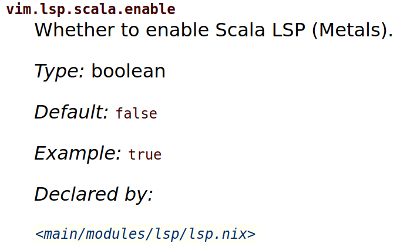

## Introduction

It is no secret that [Neovim](https://neovim.io/) is my favorite text editor. I use it on a daily basis for multiple purposes:

- To write Scala code (and the occasional Typescript) for $work.
- To write the extensive text and code for [my books](https://leanpub.com/u/gvolpe).
- To fine-tune my ever-changing [NixOS configuration](https://github.com/gvolpe/nix-config).
- To write blog posts such as this one.
- For the casual Haskell and Rust code I sometimes need to write.
- Literally for any other text file I need to explore and modify.

All this functionality is enabled by many plugins configured and tailored to my needs. Now there exist a bunch of plugin managers to handle the installation of plugins, from the classic [vim-plug](https://github.com/junegunn/vim-plug) to the more esoteric [lazy.nvim](https://github.com/folke/lazy.nvim).

On the other side we have Nix, which strives for reproducibility at all costs. Among the many packages in `nixpkgs`, [Neovim](https://github.com/NixOS/nixpkgs/blob/master/pkgs/applications/editors/neovim/default.nix) has been around for a while. Furthermore, there exist [many derivations](https://github.com/NixOS/nixpkgs/tree/master/pkgs/applications/editors/vim/plugins) so that plugins can also be installed via Nix.

Home Manager users can install and configure Neovim with any desired plugin via its [officially supported module](https://nix-community.github.io/home-manager/options.html#opt-programs.neovim.enable). Or it can also be installed directly on NixOS. In either case, everything comes from the `nixpkgs` repository.

The only downside of relying on plugins defined in `nixpkgs` is that they may get quickly outdated, forcing us to resort to overlays or overrides to actually use the latest version, or that specific fork you would like to test. This problem goes away with the introduction [Nix flakes](https://nixos.wiki/wiki/Flakes).

## Neovim Flake

Up to August 2022, my Neovim configuration was tightly coupled to my Home Manager configuration. It now lives at [neovim-coc](https://github.com/gvolpe/neovim-coc), and it is only there for archival reasons; it is no longer maintained.

It was back then when I started [Neovim Flake](https://github.com/gvolpe/neovim-flake) as a fork of [Jordan Isaacs](https://github.com/jordanisaacs)' flake. I liked the flakes approach for individual applications so much that I soon started making countless changes to adapt it to my needs and liking. It changed so much that you wouldn't recognize it from the fork.

Nowadays, it is my default Neovim configuration, and I would like to share with you what's so special about it.

Flakes consist of *inputs* and *outputs*. For instance, here are some inputs declared in the `flake.nix` file.


{
  inputs = {
    nixpkgs.url = github:nixos/nixpkgs/nixpkgs-unstable;
    flake-utils.url = github:numtide/flake-utils;

    nmd = {
      url = gitlab:rycee/nmd;
      flake = false;
    };

    nvim-lspconfig = {
      url = github:neovim/nvim-lspconfig;
      flake = false;
    };
    nvim-treesitter = {
      url = github:nvim-treesitter/nvim-treesitter;
      flake = false;
    };
}


The first two inputs correspond to `nixpkgs` (the version we want to use for all the packages) and `flake-utils` (to make it compatible with Linux and Mac, among other platforms). The third input `nmd` serves the purpose of generating documentation for the Nix modules, as we will see soon. Ultimately, the remaining inputs correspond to Neovim plugins pointing directly to their source (there are many more declared in this flake).

The outputs can be displayed by running `nix flake show`.


$ nix flake show
git+file:///home/gvolpe/workspace/neovim-flake
├───apps
│   ├───aarch64-darwin
│   │   ├───default: app
│   │   └───nvim: app
│   ├───aarch64-linux
│   │   ├───default: app
│   │   └───nvim: app
│   ├───x86_64-darwin
│   │   ├───default: app
│   │   └───nvim: app
│   └───x86_64-linux
│       ├───default: app
│       └───nvim: app
├───devShells
│   └───x86_64-linux
│       └───default: development environment 'nix-shell'
├───nixosModules
│   └───x86_64-linux: NixOS module
├───overlays
│   └───x86_64-linux: Nixpkgs overlay
└───packages
    └───x86_64-linux
        ├───default: package 'neovim-0.8.1'
        ├───docs: package 'html-manual'
        ├───metals: package 'metals-0.11.9'
        └───neovim-ide: package 'neovim-0.8.1'


We will find five different things, all with multi-platform support (only shown in `apps`, and omitted for brevity in all the other cases).

- `apps`: any program that can run via `nix run`.
- `devShells`: development shells that can be used via `nix develop`.
- `nixosModules`: modules that can be imported into your Nix system.
- `overlays`: custom packages and functions you can import into your configuration.
- `packages`: any package that can be built via `nix build`.

This is the command we use when the project is checked out locally, but it can be done remotely too.


$ nix flake show github:gvolpe/neovim-flake


In the same spirit, you can try this Neovim out with its [default configuration and enabled plugins](https://github.com/gvolpe/neovim-flake/blob/main/lib/neovim-ide-full.nix).


$ nix run github:gvolpe/neovim-flake


However, we all have different preferences, so it is normal to wish we could tweak a few settings here and there. This is made possible by the module explained in the following section.

### Home Manager module

The `nixosModules` output exposes a Home Manager module we can import into our configuration.


{
  imports = [ neovim-flake.nixosModules.hm ];
}


Once imported, we can use the module in our configuration as follows.


{
  programs.neovim-ide = {
    enable = true;
    settings = {
      vim.viAlias = false;
      vim.vimAlias = true;
      vim.lsp = {
        enable = true;
      };
    };
  };
}


It's called `neovim-ide` because it is a batteries included Neovim configuration with LSP support for various languages, but emphasizing the Scala programming language. Here's an example:


{
  vim.lsp = {
    enable = true;
    scala = {
      enable = true;
      metals = pkgs.metalsBuilder {
        version = "0.11.9+235-2f0e69f8-SNAPSHOT";
        outputHash = "sha256-9ZJ5bew+ttAr+K9vsM6DKP4G0dcAEXyBYizNA7BeeG8=";
      };
      type = "nvim-metals";
    };
  };
}


It is set to use the amazing [nvim-metals](https://github.com/scalameta/nvim-metals), and the latest snapshot of Metals. We use `pkgs.metalsBuilder` to build a custom Metals version, which is a function exposed by the `overlays` output. In order to use it, we need to add it to our configuration. For example:


{
  pkgs = import nixpkgs {
    inherit system;
    overlays = [ neovim-flake.overlays.default ];
  };
}


The module is not final by any means, and it could certainly be improved, but it is perfect for my use cases. Ultimately, adding new modules is quite straightforward via a pull request. 

For example, here's the module for the `hop` plugin.


{ config, lib, pkgs, ... }:

with lib;

let
  cfg = config.vim.hop;
in
{
  options.vim.hop = {
    enable = mkOption {
      type = types.bool;
      description = "Enable Hop plugin (easy motion)";
    };
  };

  config = mkIf cfg.enable ({
    vim.startPlugins = [ pkgs.neovimPlugins.hop ];

    vim.nnoremap = {
      "<leader>h" = "<cmd> HopPattern<CR>";
    };

    vim.luaConfigRC = ''
      require('hop').setup()
    '';
  });
}


Have a look at all the existing [modules](https://github.com/gvolpe/neovim-flake/tree/main/modules) for more details.

#### Documentation

Home Manager users are accustomed to access the [DocBook documentation](https://nix-community.github.io/home-manager/options.html) for all the available options in a specific module. NixOS users enjoy an even [better experience](https://search.nixos.org/options). Thanks to Robert Helgesson's [nmd](https://gitlab.com/rycee/nmd/), this Neovim Flake HM module is also documented at [gvolpe.com/neovim-flake](https://gvolpe.com/neovim-flake/).

For instance, the [vim.lsp.scala](https://gvolpe.com/neovim-flake/options.html#opt-vim.lsp.scala.enable) options look as follows.

### Updates

So far, we have seen how it can be used and configured, but haven't talked about one of its greatest benefits: updates. To update all inputs to their latest version, we can run the following command.


$ nix flake update


However, this is undesirable most of the time, as some plugins may break and we would not notice until we test that particular plugin, which may happen weeks after this update was performed.

In most cases, it is recommended to update a specific plugin at a time, to test it in isolation. For example:


$ nix flake lock --update-input nvim-metals
warning: updating lock file '/home/gvolpe/workspace/neovim-flake/flake.lock':
• Updated input 'nvim-metals':
    'github:scalameta/nvim-metals/b7587a9155d22761f1b28c18f7927e6df0d08387' (2022-09-05)
  → 'github:scalameta/nvim-metals/d1c01907256dae7c9d55ba1fcfb8cf6b4f583325' (2022-12-09)


The `flake.lock` file is the one keeping track of the specific versions we declare in our `flake.nix` file. Once this plugin is updated, we can try to build it via `nix build`. 

Still, it would be more interesting to test the plugin actually works with a quick manual test. To do so, we can head to any Scala project directory, and run this version of the Neovim flake there.


$ cd ../my-scala-project
$ nix run ../neovim-flake


That is all it takes! Isn't this wonderful?

This approach allows us to use whatever plugin we want in whatever version (at least most of them).

### Tree-sitter plugins

Folks who rely on [Tree-sitter](https://github.com/tree-sitter/tree-sitter), know that its installation with the many different grammars is not as trivial. Yet, Nix makes the management of tree-sitter grammars reproducible and easy to install.

For example, these are some of the inputs I declare to use the `tree-sitter-scala` fork from Eugene.


{
  inputs = {
    ts-build.url = github:pta2002/build-ts-grammar.nix;

    tree-sitter-scala = {
      url = github:eed3si9n/tree-sitter-scala/fork-integration;
      flake = false;
    };
  };
}


This is then treated specially by a library function defined by the Neovim Flake.


{
  tree-sitter-scala3 = inputs.ts-build.lib.buildGrammar pkgs {
    language = "scala";
    version = "eed3si9n-fork";
    source = inputs.tree-sitter-scala;
  };

  ts = prev.tree-sitter.override {
    extraGrammars = { inherit tree-sitter-scala3; };
  };

  treesitterGrammars = ts.withPlugins (p: [
    p.tree-sitter-scala3
    p.tree-sitter-nix
    p.tree-sitter-elm
  ]);


You can quickly look at the available grammars with the following command.


$ nix search nixpkgs tree-sitter-grammars
* legacyPackages.x86_64-linux.tree-sitter-grammars.tree-sitter-bash (0.20.7)
* legacyPackages.x86_64-linux.tree-sitter-grammars.tree-sitter-beancount (0.20.7)
* legacyPackages.x86_64-linux.tree-sitter-grammars.tree-sitter-bibtex (0.20.7)
* legacyPackages.x86_64-linux.tree-sitter-grammars.tree-sitter-c (0.20.7)


There are always plugins that require special treatment, but that's not a blocker. For instance, the Smithy grammar requires the highlights file to be copied manually for some reason, but Nix makes it easy to automate this trivial task in a reproducible way.


{
  nvimTreesitterHook = ''
    rm -r parser
    ln -s ${treesitterGrammars} parser
    mkdir -p $out/queries/smithy
    cp ${ts.builtGrammars.tree-sitter-smithy}/queries/highlights.scm $out/queries/smithy/highlights.scm
  '';
}


In most cases, building your custom tree-sitter grammar should be as simple as the `tree-sitter-scala` one.

### Conclusion

If you are still hesitating over using Nix, this blog post laid out another compelling use case :)

Give it a try (drop it a 🌟 if you enjoy it!) and if you need any help, reach out via the [discussions](https://github.com/gvolpe/neovim-flake/discussions) section.

Merry Xmas,
Gabriel.



