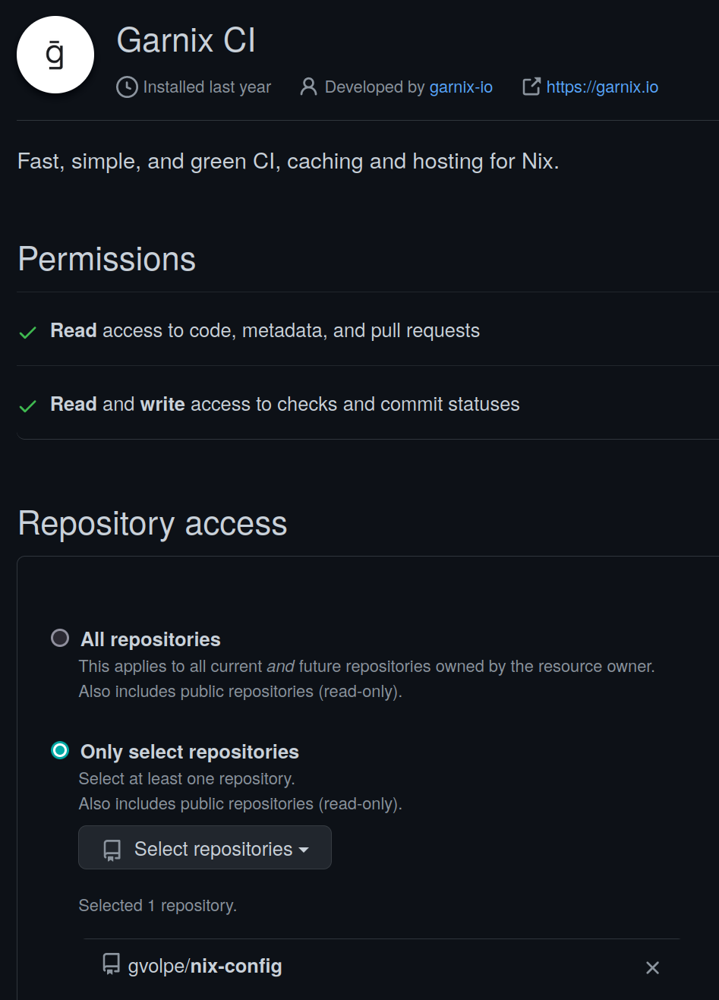
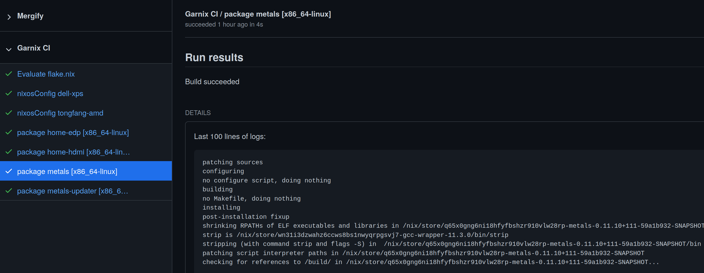
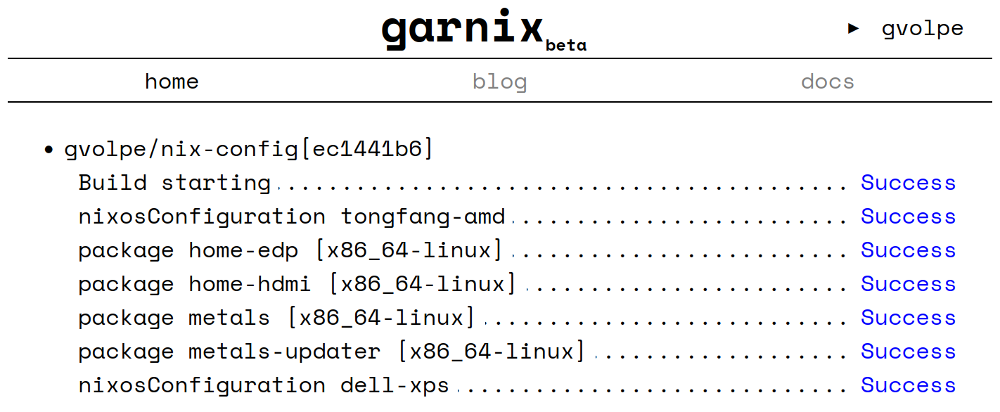
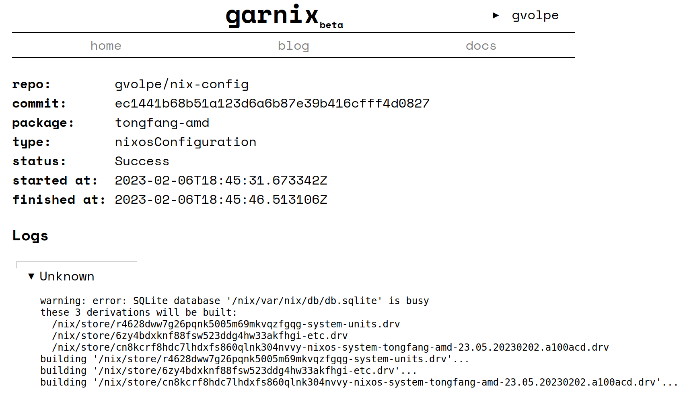

## Introduction

[Garnix](https://garnix.io/) is a continuous integration (CI) service for Nix flakes that has been in Beta for a while. In their own words:

> With Nix-specific optimizations, Garnix makes CI with Nix fast --- a few seconds for no-op changes. Easy to setup, too --- if you have a flake.nix, you are ready to go. And we provide the build results as a cache, so you don't have to build things locally. To top it all up, we run on 100% renewable energy. Because CI should bring you peace of mind.

My [Github settings](https://github.com/settings/installations) tell me I have installed the Garnix CI app in March 2022 and it's been running alongside my GHA (Github Actions) workflows ever since. However, I haven't really reaped its benefits until now.

Once you install the Garnix CI app in your Github account and enable the repositories where you want it to run, you'll notice that it will automatically detect a `flake.nix` and it will evaluate its packages, dev shells, checks and NixOS configurations. Still, this is all configurable per repository via a [garnix.yaml](https://github.com/gvolpe/nix-config/blob/master/garnix.yaml) file.

The `homeConfigurations` output is [not yet supported](https://github.com/garnix-io/issues/issues/24), but it's in the plans. A current workaround is to expose these as `packages` or `checks` instead, as I have in my flake's outputs.


{
  outputs = inputs:
    let
      system = "x86_64-linux";
      ci = import ./outputs/ci.nix { inherit inputs system; };
      inherit (inputs.nixpkgs.lib) mapAttrs;
    in
    rec {
      homeConfigurations =
        import ./outputs/home-conf.nix { inherit inputs system; };

      nixosConfigurations =
        import ./outputs/nixos-conf.nix { inherit inputs system; };

      packages.${system} = {
        inherit (ci) metals metals-updater;
      };

      checks.${system} =
        let
          os = mapAttrs (_: c: c.config.system.build.toplevel) nixosConfigurations;
          hm = mapAttrs (_: c: c.activationPackage) homeConfigurations;
        in
        os // hm;
    };
}


The downside of doing this is that building the Home Manager configurations requires [Import From Derivation (IFD)](https://nixos.wiki/wiki/Import_From_Derivation) (at least in my case) even for `nix flake show`.


$ nix flake show --allow-import-from-derivation
git+file:///home/gvolpe/workspace/nix-config?ref=...
├───checks
│   └───x86_64-linux
│       ├───dell-xps: derivation 'nixos-system-dell-xps-15-9560-23.05.20230202.a100acd'
│       ├───gvolpe-edp: derivation 'home-manager-generation'
│       ├───gvolpe-hdmi: derivation 'home-manager-generation'
│       └───tongfang-amd: derivation 'nixos-system-tongfang-amd-23.05.20230202.a100acd'
├───homeConfigurations: unknown
├───nixosConfigurations
│   ├───dell-xps: NixOS configuration
│   └───tongfang-amd: NixOS configuration
└───packages
    └───x86_64-linux
        ├───metals: package 'metals-0.11.10+117-476976c1-SNAPSHOT'
        └───metals-updater: package 'metals-updater-script'


Nevertheless, I believe the pros greatly outweigh the cons.

Here's the [pull request](https://github.com/gvolpe/nix-config/pull/162/files) I made to completely remove the GHA workflows for my configuration (including Cachix) and use Garnix instead. The build times are insanely fast!

Building my Home Manager configuration used to take about **7m 30s** with my previous setup. With Garnix, it built in **1m 45s** the first time, but it only took about **26s** in subsequent runs by leveraging its binary cache!

The dashboard is quite minimalistic and could use some improvements, but the service is still in Beta :)

If we click on the status of any build, we can see the logs whenever available.

There are a few tickets raised in their [issue tracker](https://github.com/garnix-io/issues/issues) to make it nicer and provide a better user experience, thus I believe it can only get better from now 💪

### How does it work?

How come Garnix does so much better than using plain Nix with a binary cache? It is vaguely explained it in the [what Garnix CI does](https://garnix.io/docs/steps) page, which I understand it involves the following steps.

First of all, it gets all the attribute names of the supported outputs, e.g.


$ nix eval .#packages.x86_64-linux --apply builtins.attrNames --json
["metals","metals-updater"]

$ nix eval .#checks.x86_64-linux --apply builtins.attrNames --json
["dell-xps","gvolpe-edp","gvolpe-hdmi","tongfang-amd"]


Next, it builds every attribute previously collected in *parallel*.


$ nix build .#metals --json
[{"drvPath":"/nix/store/4kql56jcvr6q0fihw2wqq56gqpf6h9gl-metals-0.11.10+111-59a1b932-SNAPSHOT.drv","outputs":{"out":"/nix/store/q65x0gng6ni18hfyfbshzr910vlw28rp-metals-0.11.10+111-59a1b932-SNAPSHOT"},"startTime":0,"stopTime":0}]

$ nix flake check # don't really know what happens after this


Finally, it uses the derivation (`drvPath`) of the outputs to query the nix log (or other heuristics when not available). I don't know exactly what this means, but by running the following command: 


$ nix show-derivation /nix/store/4kql56jcvr6q0fihw2wqq56gqpf6h9gl-metals-0.11.10+111-59a1b932-SNAPSHOT.drv


We get the following attributes: `args`, `builder`, `env`, `inputDrvs`, `inputSrcs`, `outputs`, and `system`. I assume it cleverly skips anything that hasn't changed and builds only what did change, keeping the build times as short as possible, but it's only a guess.

### Chat with Julian

I reached out to the author of Garnix, [Julian Arni](https://github.com/jkarni), and he kindly got back to me with a very detailed and speedy response, answering all my silly questions. Find them adapted a bit in the following sections.

#### Why is it faster?

There are a few reasons it's faster:

1. The cache is already in the disk, so builds don't need to push and pull from the cache. Pulling, in particular, tends to take quite a long time, since essentially nothing is there yet. I've seen 4-5 minutes of 20 minute CI runs be due to that. By default, Nix will pull even if nothing needs to be built, so even in "do nothing" runs you might end up paying that cost.

2. The cache can be shared across projects. With Cachix, each cache is kept separate, because the cache owner can push whatever they want to their cache. Garnix only allows builds that are pure by design, and that it itself has built, to enter the cache. This way, if any project or user has built the package, it's safe to re-use those artifacts. This is a lot like the `cache.nixos.org` builders, and it becomes particularly helpful if packages you depend on are also using Garnix; but even more significant with forks.

3. Garnix has more powerful machines than Github, and that in turn, enables higher **parallelism**. Additionally, rather than vCPUs, we use CPU shares. The idea is, if the machine is not busy, you get a really fast machine; that works well for everyone, since then your build is done sooner and the machine is again free (or free-er) for the next build. Throttling the CPU is terrible for overall latency, and the only advantages I can see are more predictable times for users, and easier implementation if you're using bin-packing schedulers/orchestrators.

#### What's the cache retention policy?

Regarding the cache, it just serves its own Nix store. A clear retention policy is still in the works, so relying on the cache being available longer term would be a bad idea. However, the current idea looks as follows:

- 2-3 days for commits that are no longer the head of any branch. 
- 2 weeks for the head of non-main branches
- 2-3 months for the head of `main` / `master`.

Once this is determined, it should be properly documented.

### Alternatives

The obvious alternative is Github Actions, which I just migrated away from. Furthermore, there's also [Nixbuild](https://nixbuild.net/), which is much more than a CI service, but I plan to cover it in a follow-up blog post as I'm still experimenting with it.

### Final words

Garnix is a very promising piece of software that can save you plenty of time. If you also enjoy using it and would like to see it succeed like I do, please consider [donating](https://opencollective.com/garnix_io).

Julian has also acknowledged that the sign-up process is still a bit confusing, so there are plans to improve it, but honestly I can't remember about it since I've signed up a year ago. If you are giving Garnix a try and find this to be the case, feel free to share your ideas to make it better in their issue tracker.

Best,
Gabriel.
