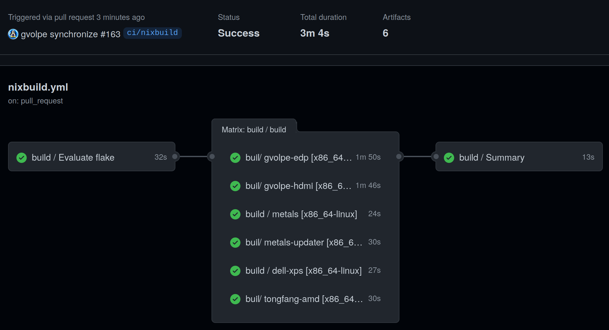
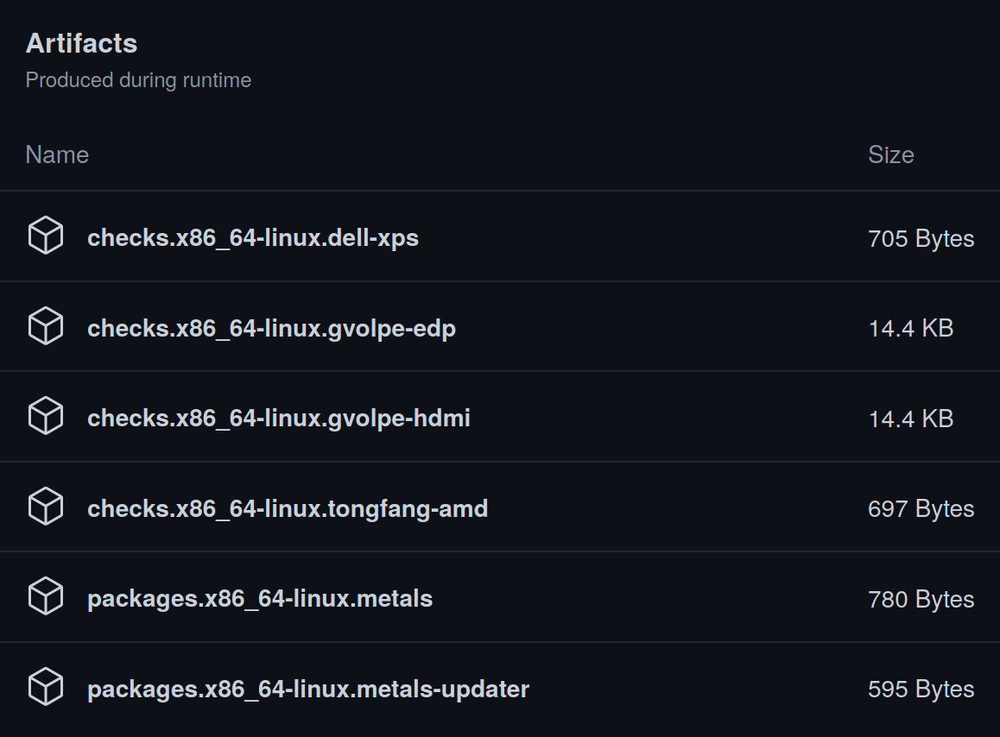
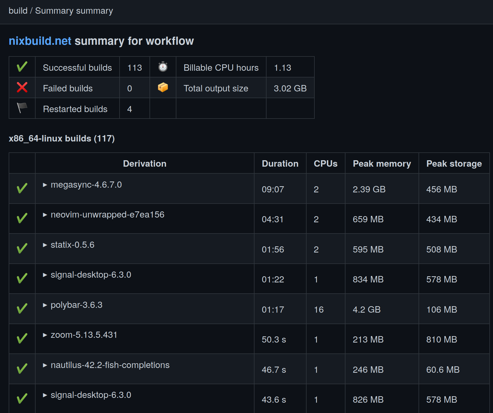

## Introduction

Quoting the [official documentation](https://nixos.org/manual/nix/stable/advanced-topics/distributed-builds.html):

> Nix supports remote builds, where a local Nix installation can forward Nix builds to other machines. This allows multiple builds to be performed in parallel and allows Nix to perform multi-platform builds in a semi-transparent way. For instance, if you perform a build for a `86_64-darwin` on an `i686-linux` machine, Nix can automatically forward the build to a `x86_64-darwin` machine, if available.

Remote builds enable interesting use cases and experiments. Besides building for different architectures, another use case that comes to mind would be having a low-resource machine building a derivation that would require heavy CPU usage (e.g. a Rust application) on the fly, without having to rely on CI builds or binary caches, effectively used as a development environment.

While this may sound too good to be truth, not everyone out there has a powerful remote machine to connect to. Moreover, we may want to give remote builds a try to find out whether it could help us solve our problems before considering purchasing a new computer. To fill this gap (and much more!), let me introduce you to Nixbuild.

### Nixbuild.net

In my [previous post](../garnix), I promised I would write a follow-up post about [Nixbuild](https://nixbuild.net/), officially promoted as follows:

> The one-stop solution for efficient builds, smart caching and ultra-fast CI pipelines. Scales by default, pay-per-use, no vendor lock-in. Supports x86 and Arm builds.

If you scroll down a bit on their site, you'll find the two fields required to sign up for a free trial: an email and an SSH key. Once you get the email to activate your account, you should head over to the [Getting started](https://docs.nixbuild.net/getting-started/) section of the documentation.

The free account includes 25 free CPU hours of build time at the moment of writing, which should be more than enough to evaluate whether this could be a good fit for us. Or even to just experiment (and have fun!) with it and learn about remote builds :)

To configure a NixOS machine to run remote builds, we need to do exactly what the documentation says:


{
  programs.ssh.extraConfig = ''
    Host eu.nixbuild.net
      PubkeyAcceptedKeyTypes ssh-ed25519
      IdentityFile /home/user/.ssh/my-nixbuild-key
  '';

  programs.ssh.knownHosts = {
    nixbuild = {
      hostNames = [ "eu.nixbuild.net" ];
      publicKey = "ssh-ed25519 AAAAC3NzaC1lZDI1NTE5AAAAIPIQCZc54poJ8vqawd8TraNryQeJnvH1eLpIDgbiqymM";
    };
  };

  nix = {
    distributedBuilds = true;
    buildMachines = [
      {
        hostName = "eu.nixbuild.net";
        system = "x86_64-linux";
        maxJobs = 100;
        supportedFeatures = [ "benchmark" "big-parallel" ];
      }
    ];
  };
}


Make sure to replace `IdentityFile` with the path to your SSH key. That's everything that's needed, as this [pull request](https://github.com/gvolpe/nix-config/pull/166/files) on my repo demonstrates.

### CI builds

Continuing with my [NixOS configuration](https://github.com/gvolpe/nix-config) as example, we can learn how to leverage Nixbuild as a CI service by using [nixbuild-action](https://github.com/nixbuild/nixbuild-action). Here are the outputs of my Nix flake.


$ nix flake show --allow-import-from-derivation
git+file:///home/gvolpe/workspace/nix-config?ref=...
├───checks
│   └───x86_64-linux
│       ├───dell-xps: derivation 'nixos-system-dell-xps-15-9560-23.05.20230202.a100acd'
│       ├───gvolpe-edp: derivation 'home-manager-generation'
│       ├───gvolpe-hdmi: derivation 'home-manager-generation'
│       └───tongfang-amd: derivation 'nixos-system-tongfang-amd-23.05.20230202.a100acd'
├───homeConfigurations: unknown
├───nixosConfigurations
│   ├───dell-xps: NixOS configuration
│   └───tongfang-amd: NixOS configuration
└───packages
    └───x86_64-linux
        ├───metals: package 'metals-0.11.10+117-476976c1-SNAPSHOT'
        └───metals-updater: package 'metals-updater-script'


To build all the `packages` and `checks`, we need the following `.github/workflows/nixbuild.yml` configuration:


name: Nixbuild demo

on:
  pull_request:

jobs:
  build:
    uses: nixbuild/nixbuild-action/.github/workflows/ci-workflow.yml@master
    secrets:
      nixbuild_ssh_key: ${ { secrets.NIXBUILD_SSH_KEY }}
    with:
      nix_conf: 'allow-import-from-derivation = true'
      filter_builds: '.top_attr == "packages" or .top_attr == "checks"'


It expects the `NIXBUILD_SSH_KEY` environment variable to be set with your private SSH key value used to sign up for Nixbuild. Note that both `homeConfigurations` and `nixosConfigurations` are exposed as checks, so these will also be built, resulting in the following workflow.

Once it finishes, it may produce some artifacts.

As well as a final summary.

I found the summaries to be extremely helpful understanding what was built on the remote machine, which can also help us understand costs.

### Final words

I gave Nixbuild a try mainly to learn about remote builds and evaluate their CI service mainly because of curiosity. However, I don't have a use case for it besides building my NixOS configuration, for which I find a CI build + a binary cache to be sufficient, but who knows? I may have a more exciting use case for it someday.

Talking specifically about CI builds, I found Garnix to be much faster compared to the free trial of Nixbuild, thus it will continue to be my daily driver. Nevertheless, Nixbuild is such a cool project and it's much more than a CI service, so I definitely encourage everyone to have a look at their extensive documentation and give it a try.

Best,
Gabriel.
