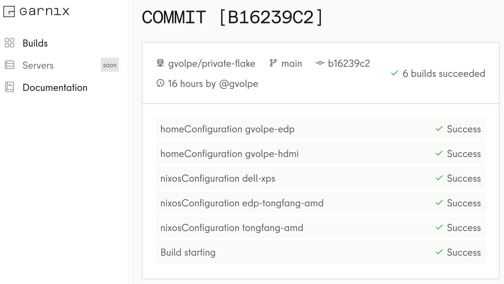

## Introduction

I blogged about [Garnix](../garnix) before, and it's the solution I've been using ever since for continuous integration. However, one thing I was missing was that private flakes were unsupported, so I had to live with a private local flake that I was commenting out on my public flake for a long time.

Github Actions does support building private flakes by providing an access token, but it's not very secure if your builds end up on a public cache anyway (not my case, though)... Garnix recently added [support for private inputs](https://garnix.io/docs/private_inputs), but it comes with some limitations (mainly due to security), so I could not take advantage of this new feature.

Unhappy with my current situation, and armed with some extra motivation, I decided to take a completely different approach... Also, I realized I hadn't blogged in more than year! Time to fix it.

### Former settings

The flake I was commenting out on my public configuration only exposed an overlay, and looked as follows on my inputs:


private-flake = {
  url = github:gvolpe/private-flake;
};


Then I would add the private overlay only when the private flake was present in my inputs, so it could also build on CI.


privateOverlay =
  if (builtins.hasAttr "private-flake" inputs)
  then private-flake.overlays.default
  else (f: p: { });


It served its purpose, but I got tired of git-stashing these changes every time I had to update my flake.

### Rethinking public flake

The solution was clear: *invert the dependency graph*.

Instead of pulling my private flake's overlays into my public configuration, why not doing it the other way around? To be frank, this is something I've thought of many times, but I was always too lazy to do anything about it ¯\\\_(ツ)_/¯

Strangely enough, not this time around, so I was ready to tackle it once and for all.

Here's what my public flake's outputs look like before:
 

{
  homeConfigurations =
    import ./outputs/home-conf.nix { inherit inputs system pkgs extraArgs; };

  nixosConfigurations =
    import ./outputs/nixos-conf.nix { inherit inputs system pkgs extraArgs; };
}


I wanted my private flake to be able to build these configurations with a custom `pkgs` instance, so the first step was to refactor these and make them builder methods on my main overlay.


{
  buildersOverlay = f: p: {
    mkHomeConfigurations = { pkgs ? f }:
      import ../outputs/home-conf.nix { inherit inputs pkgs system; };

    mkNixosConfigurations = { pkgs ? f }:
      import ../outputs/nixos-conf.nix { inherit inputs pkgs system; };
  };
}


And here's how my public flake defines its outputs right now (simple enough, no?):


{
  outputs = inputs:
    let
      system = "x86_64-linux";

      overlays = import ./lib/overlays.nix { inherit inputs system; };

      pkgs = import inputs.nixpkgs {
        inherit overlays system;
        config.allowUnfree = true;
      };
    in
    {
      inherit pkgs overlays;

      homeConfigurations = pkgs.mkHomeConfigurations { };
      nixosConfigurations = pkgs.mkNixosConfigurations { };
    };
}


It can still be built independently with sane defaults, but it's also extendable from other flakes.

### Private flake

Refactor done on the public side, now it was time to focus on the private flake. The entire `flake.nix` definition is only 17 lines long! Neat, don't you think?


{
  description = "My private flake";

  inputs.nix-config.url = github:gvolpe/nix-config;

  outputs = { nix-config, ... }:
    let
      pkgs = nix-config.pkgs.extend (import modules/overlay.nix);
    in
    {
      homeConfigurations = pkgs.mkHomeConfigurations { };
      nixosConfigurations = pkgs.mkNixosConfigurations { };
    };
}


Both Home Manager and NixOS configurations can be built by reusing the public config's `pkgs` instance, which is extended with a custom overlay.
 
The custom overlay used to contain only private stuff, but now it also contains a secrets override (more on this below):


f: p: {
  secrets = p.callPackage ./secrets.nix { };
  private.stuff = import ./private-stuff.nix;
}


I realized that my system was building, but that all my secrets were not present! \\\_(o_o)_/ 

This was the case because I use `git-crypt` on my public repo to encrypt them; one more obstacle on the road to finally nail this...

The next step was to refactor all my public encrypted secrets and centralize them in a single overlay, so here's how I define them now:


{
  githubToken = "OVERRIDE_ME";
  mimeoAssociations = "";
  ngrokToken = "OVERRIDE_ME";
  openaiApiKey = "OVERRIDE_ME";
}


This means I no longer need `git-crypt` in my public repo, but it [doesn't](https://gist.github.com/marcopaganini/62fc51a679f8985c10c3ca5d0c84031c) seem [trivial](https://github.com/AGWA/git-crypt/issues/170) to [remove it](https://github.com/AGWA/git-crypt/issues/137), so I'll get to that another day 🙄

Thus, all I have to do in my private flake is to override all these secrets in the custom overlay. Here's the `secrets.nix` file you can see referenced in the overlay above --- only showing a single secret for brevity.


{ lib, ... }:

{
  githubToken = lib.secretManager {
    filepath = ../secrets/github-token;
    fileAction = lib.readFile;
    encryptedSha256 = "ce08397723eb2c8ae9673de34fab11db8799062c2659c673b4eddbfa4e05b8e1";
    emptyValue = "";
  };
}

 
I continue to use the [secretsManager](https://github.com/gvolpe/nix-config/blob/a1db9d16c403cad14a0ec98c6fc55b491920806d/lib/default.nix#L23) function from my public flake, which also depends on the file being encrypted with `git-crypt`. This is how my secrets don't end up on a public cache.
 
Thus, I had to move all my secrets from the public repo to my private one, and set up `git-crypt` once again. Though, that's a one-time thing and I'm much happier they now live in a private repository instead.

**REPL superpower**

To quickly debug if the secrets are being set as expected, you can't beat the REPL.


$ nix repl
Welcome to Nix 2.20.3. Type :? for help.

nix-repl> :lf .
Added 15 variables.

nix-repl> inputs.nix-config.pkgs.secrets.githubToken
"OVERRIDE_ME"

nix-repl> outputs.homeConfigurations.gvolpe-hdmi.pkgs.secrets.githubToken
"this-secret-has-been-set-in-the-overlay"

nix-repl> outputs.nixosConfigurations.tongfang-amd.pkgs.secrets.githubToken
"this-secret-has-been-set-in-the-overlay"


I absolutely love this extra capability nix gives us! It feels like a superpower 🥷

### Continuous integration

With Garnix now supporting private flakes, I just needed to ensure the Garnix App had access to my private repo, as well as setting the right options on my `garnix.yaml` file.


enableGithubOrgAccessTokens: true
builds:
 exclude: []
 include:
 - homeConfigurations.*
 - nixosConfigurations.*


Once it was all set, I had my private flake successfully building my Home Manager and NixOS configurations on Garnix in no time!

 
[Garnix](https://garnix.io/) rocks! Now even more with a revamped website and UI :)

### Closing remarks

I must say I'm quite satisfied with my current solution, but we all know this is an eternal tinkering process, so I won't lie to you (and to myself) by claiming this is its final form :)

Perhaps, the only area that could use some improvement would be the management of secrets, but I don't have a big need for it as my secrets are trivial and I don't do remote server deployments and provisioning, so for now that's not something I'm willing to spend time on.

What do you think? Anything else you would improve or do differently? Let me know in the comments below!

Best,
Gabriel.
