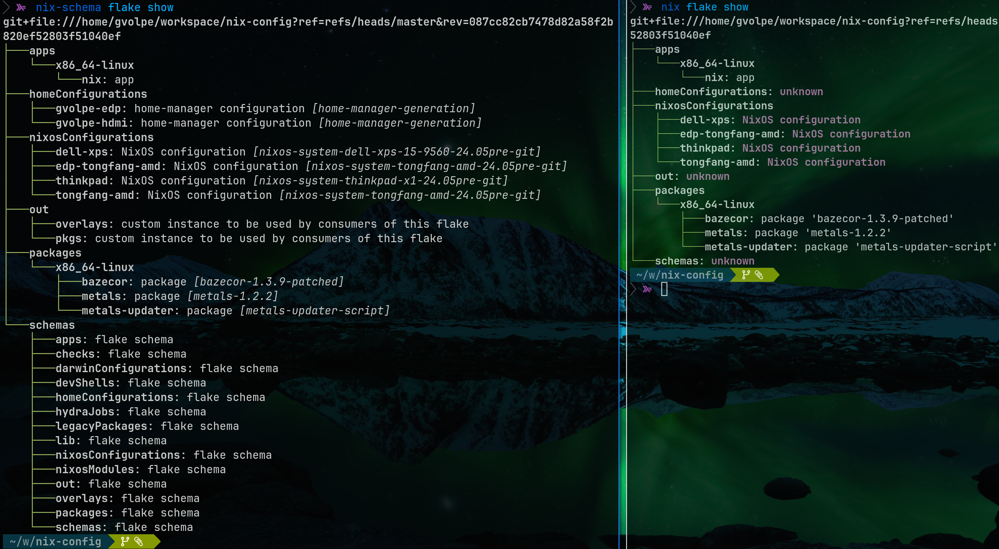

## Introduction

Flake schemas were [introduced by Determinate Systems](https://determinate.systems/posts/flake-schemas/) (written by [Eelco Dolstra](https://github.com/edolstra) --- creator of Nix) about half a year ago now (August 2023), which is quite a promising feature, but what is the current status? Is it usable yet?

The [PR](https://github.com/NixOS/nix/pull/8892) that introduces flake schemas was submitted to `NixOS/nix` the same day the announcement was made, and it sadly remains in DRAFT mode until today. However, if you look at the comments, some expert users reported using this feature successfully, so I thought it was about time to give it a shot myself.

So here's where the fun starts: in order to use it, we need *that* specific `nix` client version (from the PR) with flake schemas support, which fortunately for us, is conveniently provided on [this flake](https://github.com/DeterminateSystems/nix-src/tree/flake-schemas).

## Sneak preview

Before we look into the shenanigans we need to get through to get this working, let's appreciate for a second what it brings to the table.

Shown below is a side-by-side comparison of `nix flake show`'s output on my [NixOS configuration](https://github.com/gvolpe/nix-config) flake:

Neat! Don't you think? I was irked by the usual `homeConfigurations: unknown` output.

## Making it work

One would need to add [DeterminateSystems/flake-schemas](https://github.com/DeterminateSystems/flake-schemas) as an input to `flake.nix`, but you'll find there are a few useful open PRs since last year that solve real problems, but pretty much like the entire feature, they also seem inactive. So to try this out, I've made [a fork](https://github.com/gvolpe/flake-schemas) and applied some of those patches myself.

With that out of the way, we can now define the schema inputs in our flake:


{
  inputs = {
    nixpkgs.url = "nixpkgs/nixos-unstable";
    flake-schemas.url = "github:gvolpe/flake-schemas";

    ## nix client with schema support: see https://github.com/NixOS/nix/pull/8892
    nix-schema = {
      inputs.flake-schemas.follows = "flake-schemas";
      url = "github:DeterminateSystems/nix-src/flake-schemas";
    };
  };
}


And as outputs, we define the standard schemas plus a custom one we'll see soon:


{
  schemas =
    inputs.flake-schemas.schemas //
    import ./lib/schemas.nix { inherit (inputs) flake-schemas; };
}


As pointed out by Greg in [one of the open issues](https://github.com/DeterminateSystems/flake-schemas/issues/14), the `nix` client from the fork doesn't build straight away, so we need some tweaks that the following overlay takes care of:


f: p: {
  nix-schema = inputs.nix-schema.packages.${system}.nix.overrideAttrs (old: {
    doCheck = false;
    doInstallCheck = false;
    postInstall = old.postInstall + ''
      rm $out/bin/nix-*
      mv $out/bin/nix $out/bin/nix-schema
    '';
  });
};


Then we can add it to our system packages, conveniently named `nix-schema` to avoid conflicts:


{
  environment.systemPackages = [
    pkgs.nix-schema
  ];
}


NOTE: the `rm $out/bin/nix-*` bit ensures that all the usual commands such as `nix-build`, `nix-shell`, etc don't get overridden, which is [one of the issues I got myself into](https://discourse.nixos.org/t/the-program-nix-build-is-not-in-your-path/42943).

Next we have the `lib/schemas.nix` file referenced above, which defines the schema for the `out` custom output in my `nix-config` repo, which is a rather simple example of a flake schema:


{ flake-schemas }:

{
  out = {
    version = 1;
    doc = "Exports custom attrsets...";
    inventory = output:
      flake-schemas.lib.mkChildren (builtins.mapAttrs
        (_: _: {
          what = "custom instance to be used by consumers of this flake";
        })
        output);
  };
}


Explaining how flake schemas are actually defined is out of the scope of this post, but the meaning of "inventory", "children" and other fields is briefly documented in the linked nix PR.

Moreover, the `nix` client is handily exposed as a flake app:


{
  apps.${system}."nix" = {
    type = "app";
    program = "${pkgs.nix-schema}/bin/nix-schema";
  };
}


So we can run it directly from this flake without installing the special `nix` version.


$ nix run github:gvolpe/nix-config#nix -- --version
nix-schema (Nix) 2.21.0pre20240311_d76e5fb


### Give it a try (Linux only)

You can run the following command in any of your flake repositories to see the new "show" output:


$ nix run github:gvolpe/nix-config#nix -- flake show


Notice that the `nix` client exposed on my flake is only compiled for Linux; though, you can follow the same steps and build it for other systems in the same fashion.
 
One thing I noticed is that if your flake doesn't explicitly define `flake-schemas` as an input, then `homeManagerConfigurations` is not properly detected, but it could be something wrong with [my implementation](https://github.com/gvolpe/flake-schemas/blob/7d762079449d0ca63e92b0128c885021168c0c79/flake.nix#L242) too, no idea (if you know what's wrong, please let me know!).
 
Another caveat of using the new command is that it's quite slow, as it seems to evaluate all outputs. For instance, it took about **~33.7 seconds** to evaluate my `nix-config` flake the first time, as shown in [this PR comment](https://github.com/gvolpe/nix-config/pull/254#issuecomment-2042471639).

Furthermore, there are a few schemas like `homeModules` and `nixosModules` that are unsupported at the moment, but that's just a matter of adding the right schemas in place.

## Final thoughts
 
I love this proposal and I wish it moves forward soon, so that every Nix user out there gets to enjoy it! However, considering how long it has been since its announcement, I'm not sure what to think.

Frankly, I find the inactivity in the main `flake-schemas` repository as well as in the initial `nix` pull request a bit worrying, but I'm hoping it all turns out in a positive way.

Have you tried flake schemas yet? What was your experience like?

Best,
Gabriel.
